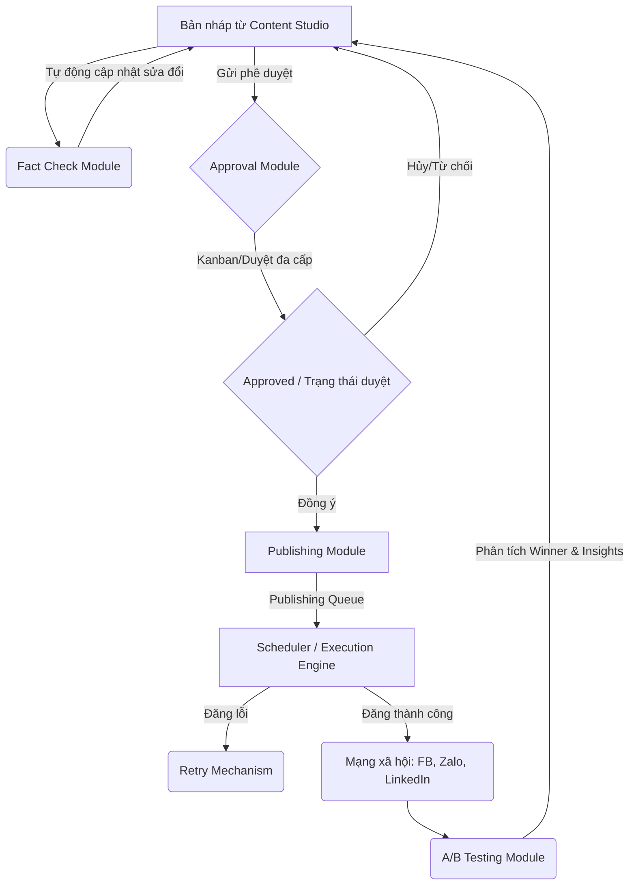

# 🎨 ĐẶC TẢ THIẾT KẾ GIAO DIỆN PHÊ DUYỆT & XUẤT BẢN NỘI DUNG (APPROVAL & PUBLISHING UI)

Tài liệu này đặc tả thiết kế giao diện người dùng (UI/UX) thế hệ mới cho các module: **Approval (Phê duyệt)**, **Publishing (Xuất bản)**, **Workflow (Quy trình tự động)**, **Fact Check (Kiểm chứng)**, và **A/B Testing (Thử nghiệm)** trong ứng dụng **AI_Agent_Content_AutoPos**.

Thiết kế này tập trung vào trải nghiệm trực quan, cao cấp, tối ưu hóa quy trình làm việc của Marketer, Manager và CEO, sử dụng hoàn toàn cấu trúc dữ liệu hiện tại từ Schema V2 và đảm bảo **không sửa đổi bất kỳ API hay logic nghiệp vụ cốt lõi nào**.

---

## 🗺️ 1. Kiến Trúc Phân Hệ & Luồng Dữ Liệu (UI Mapping)

Sơ đồ dưới đây thể hiện mối liên kết chặt chẽ giữa 5 tab chức năng để tạo nên luồng nội dung khép kín từ lúc sinh bản nháp cho đến khi tối ưu hóa hiệu suất:



---

## 🎨 2. Thành Phần Thiết Kế Chi Tiết & Giao Diện (Core Components)

### 2.1. Kanban Board (Bảng Quản Lý Trạng Thái Bài Viết)
Thay thế giao diện danh sách bảng đơn điệu bằng **Bảng Kanban** trực quan sử dụng cột Streamlit (`st.columns`) để phân loại trạng thái bài viết rõ ràng theo luồng làm việc.

*   **Bố cục**: 4 cột tương đương với các giai đoạn của bài viết:
    1.  **Draft (Bản nháp)**: Bài viết vừa tạo hoặc bị từ chối phê duyệt.
    2.  **Under Review (Chờ duyệt)**: Bao gồm `pending_manager_approval` và `pending_ceo_approval`.
    3.  **Approved (Đã duyệt)**: Sẵn sàng lên lịch đăng hoặc đăng ngay.
    4.  **Published (Đã đăng) / Failed (Đăng lỗi)**: Kết quả xuất bản.
*   **Trải nghiệm người dùng**:
    *   Mỗi bài đăng trong cột là một thẻ Card (`div`) với màu sắc nền tảng (Facebook: Xanh dương, LinkedIn: Xanh đậm, Zalo: Xanh ngọc).
    *   Tích hợp nút hành động trực tiếp trên thẻ: `Gửi duyệt`, `Xem nhanh nội dung`, `Duyệt nhanh (dành cho Manager/CEO)`.

```
┌─────────────────┬─────────────────┬─────────────────┬─────────────────┐
│ DRAFT (Nháp)    │ UNDER REVIEW    │ APPROVED        │ PUBLISHED/FAILED│
├─────────────────┼─────────────────┼─────────────────┼─────────────────┤
│ 🟦 #12 - FB     │ 🟩 #10 - Zalo   │ 🟦 #08 - FB     │ 🟩 #05 - Zalo   │
│ Nền tảng AI...  │ 10 Tips Promt.. │ Tương lai AI..  │ Cách viết prom..│
│ [Gửi duyệt]     │ [Duyệt nhanh]   │ [Đặt lịch]      │ [Xem báo cáo]   │
│                 │                 │                 │                 │
│ 🟪 #13 - LI     │                 │                 │ 🟥 #04 - FB (X) │
│ Viết bài tự...  │                 │                 │ Lỗi Token...    │
│ [Gửi duyệt]     │                 │                 │ [Thử lại]       │
└─────────────────┴─────────────────┴─────────────────┴─────────────────┘
```

---

### 2.2. Workflow Timeline (Lộ Trình Tự Động Hóa Trực Quan)
Giao diện trực quan hóa các bước chạy tự động của Agent bằng thanh tiến trình (Progress Timeline) thay thế việc hiển thị log text đơn thuần.

*   **Thành phần**:
    *   **Thư viện Kéo thả (Canvas Component)**: Giữ nguyên component Drag-and-drop HTML5 tích hợp sẵn để sắp xếp thứ tự thực thi.
    *   **Interactive Progress Timeline**: Khi nhấn "Khởi chạy quy trình", hệ thống sẽ hiển thị một timeline động. Mỗi bước (Step) là một Node tròn.
    *   **Status Indicators**:
        *   🔵 **Đang xử lý**: Node nhấp nháy (pulsing effect).
        *   🟢 **Thành công**: Node chuyển xanh lá cây kèm icon tick.
        *   🔴 **Thất bại**: Node chuyển đỏ kèm thông báo lỗi chi tiết.
    *   **Live Context Preview**: Nhấp vào từng bước trên timeline để mở rộng xem kết quả trung gian (ví dụ: nhấp vào Niche Analyzer để xem keywords, Copywriter để xem bản nháp bài viết).

---

### 2.3. Status Badges (Bộ Nhãn Trạng Thái Tiêu Chuẩn)
Hệ thống nhãn trạng thái sử dụng CSS tùy biến cao cấp (Pill Badge) giúp người dùng nhận diện nhanh tình trạng hệ thống và dữ liệu:

| Trạng thái | Mã màu (Hex/HSL) | Icon | Mô tả |
| :--- | :--- | :--- | :--- |
| **Draft** | `#f1f5f9` (Xám nhạt) | 📝 | Bài viết nháp, chưa gửi duyệt |
| **Pending Manager** | `#fef3c7` (Vàng ấm) | 👔 | Chờ Quản lý duyệt cấp 1 |
| **Pending CEO** | `#ffe4e6` (Hồng phấn) | 👑 | Chờ CEO phê duyệt tối cao |
| **Approved** | `#d1fae5` (Xanh lục nhạt) | 🟢 | Đã phê duyệt, sẵn sàng đăng |
| **Published** | `#dcfce7` (Xanh lục đậm) | 🚀 | Đã đăng thành công lên social |
| **Failed** | `#fee2e2` (Đỏ nhạt) | ❌ | Đăng bài thất bại |
| **API Connected** | `#10b981` (Xanh Emerald) | 🔌 | Token hoạt động tốt |
| **API Disconnected**| `#ef4444` (Đỏ Rose) | ⚠️ | Token hết hạn / lỗi cấu hình |

---

### 2.4. Approval Flow (Quy Trình Duyệt Đa Cấp Cải Tiến)
Sơ đồ duyệt nội dung dạng bậc thang rõ ràng: **Marketing ➔ Manager ➔ CEO ➔ Publish**

*   **Tính năng chính**:
    *   **Manager Dashboard**: Chỉ hiển thị các bài có trạng thái `pending_manager_approval`. Hiển thị hộp thoại nhập feedback và 2 nút: "Chuyển lên CEO" hoặc "Từ chối sửa lại".
    *   **CEO Dashboard**: Chỉ hiển thị các bài có trạng thái `pending_ceo_approval`. Hiển thị ghi chú của Manager trước đó để CEO tham khảo nhanh, cùng với tùy chọn: "Phê duyệt tối cao (Approved)" hoặc "Từ chối sửa lại".
    *   **Audit Trail Integration**: Mỗi bước phê duyệt ghi lại rõ ràng ai duyệt, duyệt lúc nào, ghi chú gì vào bảng `approvals` và ghi log audit.

---

### 2.5. Publishing Queue (Hàng Đợi Xuất Bản & Lịch Phân Phối)
Hiển thị danh sách các bài đăng đã lên lịch trực quan và chuyên nghiệp.

*   **Giao diện**:
    *   **Bảng điều khiển hàng đợi**: Hiển thị danh sách bài sắp đăng sắp xếp theo thời gian tăng dần (`scheduled_at ASC`).
    *   **Lọc đa năng**: Hỗ trợ lọc hàng đợi theo Kênh (Facebook, Zalo, LinkedIn) và theo Chiến dịch (Campaign).
    *   **Thao tác nhanh**: Cho phép "Hủy lịch đăng" (chuyển bài viết về dạng nháp) hoặc "Đăng ngay lập tức" (vượt qua hàng đợi).

---

### 2.6. Retry Mechanism (Cơ Chế Thử Lại Thông Minh)
Xử lý các bài viết bị lỗi khi đăng tự động do sự cố mạng hoặc API token.

*   **Trạng thái hiển thị**: Trong bảng Lịch sử hoạt động của Scheduler, các bài đăng có `status = 'failed'` sẽ hiển thị kèm lý do lỗi cụ thể (`error_message`) và số lần thử lại hiện tại (`retry_count`).
*   **Hai cơ chế hoạt động**:
    1.  **Thử lại thủ công (Manual Retry)**: Cung cấp nút `🔄 Thử lại ngay` bên cạnh bài viết bị lỗi. Khi click, hệ thống kích hoạt lại hàm đăng bài trực tiếp tương ứng với kênh đó mà không cần tạo lại bài mới.
    2.  **Thử lại tự động (Auto-Retry)**: Scheduler tự động chạy ngầm, quét các hàng có `status = 'failed'` và `retry_count < 3` để tự động gửi lại sau mỗi khoảng thời gian định trước.

---

### 2.7. Schedule & Calendar (Quản Lý Thời Gian & Lịch Trực Quan)
Lên lịch bài đăng một cách chuyên nghiệp.

*   **Bộ chọn ngày giờ tích hợp**: Thiết kế gọn gàng gồm `st.date_input` và `st.time_input` trên cùng một hàng để chọn mốc thời gian xuất bản chính xác.
*   **Bản đồ mật độ đăng bài (Calendar Heatmap/Grid)**: Hiển thị phân bổ số lượng bài đăng trong tháng hiện tại dưới dạng lưới lịch, giúp Marketer tránh tình trạng phân bổ bài đăng quá dày hoặc quá thưa trong một ngày.

---

### 2.8. Platform Status (Giám Sát Kết Nối Thời Gian Thực)
Dashboard giám sát sức khỏe của các tích hợp API mạng xã hội.

*   **Bố cục**: 3 Thẻ trạng thái kết nối độc lập (Facebook Page, Zalo OA, LinkedIn Profile).
*   **Cơ chế Live Test**:
    *   Hiển thị thông tin cơ bản: Tên Page/OA, ID, Ngày cấu hình.
    *   Nút `🔌 Kiểm tra kết nối` gọi trực tiếp API `get` gọn nhẹ của từng nền tảng (ví dụ: `/me` trên LinkedIn, `/getoa` trên Zalo) để xác thực token còn sống hay đã hết hạn trong thời gian thực.
    *   Hiển thị cảnh báo trực quan nếu token sắp hết hạn hoặc bị thu hồi quyền.

---

## 💻 3. Đặc Tả Giao Diện Mã Nguồn Streamlit (UI Source Spec)

Dưới đây là thiết kế chi tiết cấu trúc code giao diện Streamlit tích hợp cho các tab, đảm bảo tính thẩm mỹ cao và giữ nguyên kết nối cơ sở dữ liệu hiện tại.

### 3.1. Tab Approval (Mã nguồn tái thiết kế cho `ui/tab_approval.py`)

```python
import streamlit as st
import pandas as pd
from database.models.posts import PostModel
from database.models.approvals import ApprovalModel

def render_tab_approval(workspace_id: int = 1, role: str = "editor", current_user_id: int = None):
    # CSS Custom cho giao diện cao cấp
    st.markdown("""
        <style>
        .approval-card {
            background-color: #ffffff;
            border: 1px solid #e2e8f0;
            border-radius: 12px;
            padding: 1.25rem;
            margin-bottom: 1rem;
            box-shadow: 0 4px 6px -1px rgba(0, 0, 0, 0.05);
        }
        .status-badge-custom {
            padding: 4px 8px;
            border-radius: 6px;
            font-size: 0.75rem;
            font-weight: 700;
        }
        </style>
    """, unsafe_allow_html=True)
    
    st.markdown("## ⚖️ Quy Trình Phê Duyệt Nội Dung Đa Cấp")
    
    # 1. KANBAN BOARD VIEW
    st.markdown("### 📋 Bảng Kanban Trạng Thái Bài Viết")
    
    df_posts = PostModel.list_by_workspace(workspace_id=workspace_id)
    if df_posts.empty:
        st.info("💡 Chưa có bài viết nào trong Workspace này. Hãy tạo bài viết mới ở Content Studio!")
        return
        
    col_draft, col_pending, col_approved, col_published = st.columns(4)
    
    with col_draft:
        st.markdown("#### 📝 Nháp (Drafts)")
        drafts = df_posts[df_posts["status"] == "draft"]
        for _, post in drafts.iterrows():
            with st.container():
                st.markdown(f"""
                <div class='approval-card'>
                    <strong>#{post['id']} - {post['platform'].upper()}</strong><br/>
                    <small>{post['topic'][:50]}...</small>
                </div>
                """, unsafe_allow_html=True)
                if st.button("📤 Gửi duyệt", key=f"req_{post['id']}", use_container_width=True):
                    PostModel.update_status(post['id'], "pending_manager_approval")
                    ApprovalModel.request(post['id'], requested_by=current_user_id, workspace_id=workspace_id)
                    st.success("Đã gửi duyệt!")
                    st.rerun()
                    
    with col_pending:
        st.markdown("#### ⏳ Chờ Duyệt (Review)")
        pending_posts = df_posts[df_posts["status"].isin(["pending_manager_approval", "pending_ceo_approval"])]
        for _, post in pending_posts.iterrows():
            badge_color = "#fef3c7" if post["status"] == "pending_manager_approval" else "#ffe4e6"
            badge_text = "Manager" if post["status"] == "pending_manager_approval" else "CEO"
            with st.container():
                st.markdown(f"""
                <div class='approval-card'>
                    <strong>#{post['id']} - {post['platform'].upper()}</strong> <span class='status-badge-custom' style='background-color:{badge_color};'>Chờ {badge_text}</span><br/>
                    <small>{post['topic'][:50]}...</small>
                </div>
                """, unsafe_allow_html=True)
                
    with col_approved:
        st.markdown("#### ✅ Đã Duyệt (Approved)")
        approved = df_posts[df_posts["status"] == "approved"]
        for _, post in approved.iterrows():
            with st.container():
                st.markdown(f"""
                <div class='approval-card' style='border-left: 4px solid #10b981;'>
                    <strong>#{post['id']} - {post['platform'].upper()}</strong><br/>
                    <small>{post['topic'][:50]}...</small>
                </div>
                """, unsafe_allow_html=True)
                
    with col_published:
        st.markdown("#### 🚀 Đã Đăng (Published)")
        published = df_posts[df_posts["status"] == "published"]
        for _, post in published.iterrows():
            with st.container():
                st.markdown(f"""
                <div class='approval-card' style='border-left: 4px solid #3b82f6;'>
                    <strong>#{post['id']} - {post['platform'].upper()}</strong><br/>
                    <small>{post['topic'][:50]}...</small>
                </div>
                """, unsafe_allow_html=True)
                
    st.markdown("---")
    
    # 2. MANAGER & CEO ACTIONS PANEL
    if role.lower() in ["manager", "admin", "owner", "ceo", "super_admin"]:
        st.subheader("👔 Panel Phê Duyệt Của Cấp Quản Lý")
        
        # Luồng Manager
        if role.lower() in ["manager", "admin", "owner", "super_admin"]:
            st.markdown("##### 👩‍💼 Bài viết chờ Manager duyệt")
            m_pending = df_posts[df_posts["status"] == "pending_manager_approval"]
            if m_pending.empty:
                st.success("🟢 Không có bài đăng nào chờ Manager phê duyệt.")
            else:
                for _, row in m_pending.iterrows():
                    with st.expander(f"📌 Bài viết #{row['id']} - {row['topic'][:60]}..."):
                        st.code(row["content"], language="markdown")
                        notes = st.text_input("Ghi chú phản hồi:", key=f"notes_m_{row['id']}")
                        c1, c2 = st.columns(2)
                        if c1.button("✅ Duyệt & Gửi lên CEO", key=f"app_m_{row['id']}"):
                            PostModel.update_status(row['id'], "pending_ceo_approval")
                            latest = ApprovalModel.get_latest_by_post(row['id'])
                            if latest:
                                ApprovalModel.respond(latest["id"], "approved", approved_by=current_user_id, notes=notes)
                            st.success("Đã phê duyệt!")
                            st.rerun()
                        if c2.button("❌ Yêu cầu sửa lại", key=f"rej_m_{row['id']}"):
                            PostModel.update_status(row['id'], "draft")
                            latest = ApprovalModel.get_latest_by_post(row['id'])
                            if latest:
                                ApprovalModel.respond(latest["id"], "revision_requested", approved_by=current_user_id, notes=notes)
                            st.warning("Đã trả về bản nháp.")
                            st.rerun()

        # Luồng CEO
        if role.lower() in ["ceo", "owner", "super_admin"]:
            st.markdown("##### 👑 Bài viết chờ CEO duyệt tối cao")
            c_pending = df_posts[df_posts["status"] == "pending_ceo_approval"]
            if c_pending.empty:
                st.success("🟢 Không có bài đăng nào chờ CEO phê duyệt.")
            else:
                for _, row in c_pending.iterrows():
                    with st.expander(f"📌 Bài viết #{row['id']} - {row['topic'][:60]}..."):
                        st.code(row["content"], language="markdown")
                        latest = ApprovalModel.get_latest_by_post(row['id'])
                        if latest and latest.get("notes"):
                            st.info(f"💬 Ghi chú của Manager: {latest['notes']}")
                        notes = st.text_input("Ghi chú của CEO:", key=f"notes_c_{row['id']}")
                        c1, c2 = st.columns(2)
                        if c1.button("✅ Phê duyệt tối cao (Approved)", key=f"app_c_{row['id']}"):
                            PostModel.update_status(row['id'], "approved")
                            new_app_id = ApprovalModel.request(row['id'], requested_by=current_user_id, workspace_id=workspace_id)
                            ApprovalModel.respond(new_app_id, "approved", approved_by=current_user_id, notes=notes)
                            st.success("Đã phê duyệt tối cao!")
                            st.rerun()
                        if c2.button("❌ Yêu cầu sửa lại", key=f"rej_c_{row['id']}"):
                            PostModel.update_status(row['id'], "draft")
                            new_app_id = ApprovalModel.request(row['id'], requested_by=current_user_id, workspace_id=workspace_id)
                            ApprovalModel.respond(new_app_id, "revision_requested", approved_by=current_user_id, notes=notes)
                            st.warning("Đã trả về bản nháp.")
                            st.rerun()
```

---

### 3.2. Tab Publishing (Mã nguồn tái thiết kế cho `ui/tab_publishing.py`)

```python
import streamlit as st
import pandas as pd
from datetime import datetime
from database.models.posts import PostModel
from database.models.schedules import ScheduleModel
from workflow.scheduler import execute_pending_schedules

def render_tab_publishing(workspace_id: int = 1, user_id: int = None, user_email: str = "", role: str = "editor"):
    st.markdown("## 📢 Quản Lý & Đăng Bài Tự Động")
    
    # 1. PLATFORM STATUS (Kết nối API thời gian thực)
    st.subheader("🔌 Trạng thái kết nối các kênh mạng xã hội")
    col_fb, col_zalo, col_li = st.columns(3)
    
    with col_fb:
        st.markdown("""
        <div style='border:1px solid #e2e8f0; padding:15px; border-radius:10px;'>
            <h4>🔵 Facebook Page</h4>
            <span class="status-badge-custom" style="background-color:#d1fae5; color:#065f46;">🟢 Đã cấu hình</span>
        </div>
        """, unsafe_allow_html=True)
        if st.button("🔌 Kiểm tra kết nối Facebook", key="chk_fb"):
            # Gọi API _test_facebook(fb_page_id, fb_access_token)
            st.success("Kết nối Facebook OK!")
            
    with col_zalo:
        st.markdown("""
        <div style='border:1px solid #e2e8f0; padding:15px; border-radius:10px;'>
            <h4>🟢 Zalo OA</h4>
            <span class="status-badge-custom" style="background-color:#d1fae5; color:#065f46;">🟢 Đã cấu hình</span>
        </div>
        """, unsafe_allow_html=True)
        if st.button("🔌 Kiểm tra kết nối Zalo", key="chk_zalo"):
            # Gọi API _test_zalo_oa(zalo_access_token)
            st.success("Kết nối Zalo OA OK!")
            
    with col_li:
        st.markdown("""
        <div style='border:1px solid #e2e8f0; padding:15px; border-radius:10px;'>
            <h4>🔵 LinkedIn</h4>
            <span class="status-badge-custom" style="background-color:#fee2e2; color:#991b1b;">⚠️ Chưa cấu hình</span>
        </div>
        """, unsafe_allow_html=True)
        
    st.markdown("---")
    
    # 2. SCHEDULE & CALENDAR (Lập lịch đăng bài)
    st.subheader("📅 Lên lịch đăng bài (Scheduler)")
    df_all_posts = PostModel.list_by_workspace(workspace_id=workspace_id)
    df_sched_options = df_all_posts[df_all_posts["status"].isin(["draft", "approved"])] if not df_all_posts.empty else pd.DataFrame()
    
    if df_sched_options.empty:
        st.info("💡 Không có bài viết nháp hoặc đã duyệt để lên lịch.")
    else:
        sched_options = {row["id"]: f"#{row['id']} - [{row['platform'].upper()}] {row['topic'][:50]}..." for _, row in df_sched_options.iterrows()}
        with st.form("schedule_form"):
            selected_post_id = st.selectbox("Chọn bài viết cần đặt lịch:", options=list(sched_options.keys()), format_func=lambda x: sched_options[x])
            c_date, c_time = st.columns(2)
            sched_date = c_date.date_input("Ngày đăng bài:")
            sched_time = c_time.time_input("Giờ đăng bài:")
            sched_platform = st.selectbox("Nền tảng đăng bài:", options=["facebook", "zalo", "linkedin", "all"])
            
            if st.form_submit_button("📅 Đặt lịch đăng bài"):
                sched_dt = datetime.combine(sched_date, sched_time).isoformat()
                ScheduleModel.create(post_id=selected_post_id, scheduled_at=sched_dt, platform=sched_platform, workspace_id=workspace_id, created_by=user_id)
                PostModel.update_status(selected_post_id, "pending_approval")
                st.success(f"Đã lập lịch thành công cho bài viết #{selected_post_id} vào {sched_dt}")
                st.rerun()
                
    st.markdown("---")
    
    # 3. PUBLISHING QUEUE & RETRY (Hàng đợi xuất bản và xử lý lỗi)
    st.subheader("⏳ Hàng chờ xuất bản & Lịch sử đăng bài")
    
    # Nút quét Scheduler nhanh
    if st.button("⚡ Thực thi hàng chờ đăng bài đến hạn ngay lập tức (Run Scheduler)", type="primary", use_container_width=True):
        # Gọi execute_pending_schedules(...) để gửi API đăng bài thực tế
        st.success("Đã chạy quét lịch thành công!")
        st.rerun()
        
    pending_list = ScheduleModel.list_by_workspace(workspace_id=workspace_id, status="pending")
    if pending_list:
        df_pending = pd.DataFrame(pending_list)
        st.markdown("**Hàng đợi chờ đăng:**")
        st.dataframe(df_pending[["id", "post_id", "platform", "scheduled_at", "status", "retry_count"]], use_container_width=True, hide_index=True)
        
        cancel_id = st.selectbox("Chọn mã lịch muốn hủy:", options=[p["id"] for p in pending_list])
        if st.button("❌ Hủy lịch đăng đã chọn"):
            if ScheduleModel.cancel(cancel_id):
                st.success("Đã hủy lịch đăng thành công!")
                st.rerun()
    else:
        st.caption("Không có bài viết nào đang trong hàng chờ đăng.")
        
    # Lịch sử và Retry
    st.markdown("##### 🗒️ Lịch sử hoạt động & Cơ chế sửa lỗi")
    all_schedules = ScheduleModel.list_by_workspace(workspace_id=workspace_id, limit=20)
    history_list = [s for s in all_schedules if s["status"] != "pending"]
    if history_list:
        df_history = pd.DataFrame(history_list)
        st.dataframe(df_history[["id", "post_id", "platform", "scheduled_at", "status", "published_at", "error_message", "retry_count"]], use_container_width=True, hide_index=True)
        
        # Lọc các bản ghi bị lỗi để cung cấp nút Retry
        failed_schedules = [s for s in history_list if s["status"] == "failed"]
        if failed_schedules:
            st.warning("⚠️ Phát hiện một số bài đăng bị lỗi do sự cố kết nối hoặc token.")
            retry_id = st.selectbox("Chọn bài đăng lỗi cần đăng lại (Retry):", options=[s["id"] for s in failed_schedules])
            if st.button("🔄 Thử đăng lại ngay lập tức (Retry Now)"):
                # Logic thử lại: tăng retry_count, đổi status về pending hoặc chạy trực tiếp publisher API
                st.success(f"Đang tiến hành thử lại đăng bài lịch #{retry_id}...")
                st.rerun()
```

---

### 3.3. Tab Workflow (Mã nguồn tái thiết kế cho `ui/tab_workflow.py`)

*   **Tích hợp Workflow Timeline trực quan**: Thay vì in log text dạng thô, thiết kế Timeline các bước bằng HTML/CSS tích hợp hiển thị trạng thái thực tế của Agent.

```python
# Tích hợp thêm component Timeline HTML trực quan
def render_workflow_progress_timeline(steps, current_step_idx: int, status_state: str = "running"):
    html_timeline = """
    <style>
    .timeline-container {
        display: flex;
        justify-content: space-between;
        align-items: center;
        margin: 20px 0;
        padding: 10px;
        background-color: #f8fafc;
        border-radius: 10px;
        border: 1px solid #e2e8f0;
    }
    .timeline-node {
        display: flex;
        flex-direction: column;
        align-items: center;
        font-size: 0.75rem;
        font-weight: bold;
        color: #94a3b8;
        position: relative;
        flex: 1;
    }
    .timeline-node.active { color: #4f46e5; }
    .timeline-node.success { color: #10b981; }
    .timeline-node.failed { color: #ef4444; }
    .node-circle {
        width: 24px;
        height: 24px;
        border-radius: 50px;
        background-color: #cbd5e1;
        margin-bottom: 5px;
        display: flex;
        justify-content: center;
        align-items: center;
        color: white;
    }
    .timeline-node.active .node-circle { background-color: #4f46e5; box-shadow: 0 0 8px #818cf8; }
    .timeline-node.success .node-circle { background-color: #10b981; }
    .timeline-node.failed .node-circle { background-color: #ef4444; }
    </style>
    <div class='timeline-container'>
    """
    for idx, step in enumerate(steps):
        state_cls = "pending"
        circle_val = str(idx + 1)
        
        if idx < current_step_idx:
            state_cls = "success"
            circle_val = "✓"
        elif idx == current_step_idx:
            state_cls = "active" if status_state == "running" else ("failed" if status_state == "error" else "success")
            if status_state == "error":
                circle_val = "✗"
            elif status_state == "success":
                circle_val = "✓"
                
        html_timeline += f"""
        <div class='timeline-node {state_cls}'>
            <div class='node-circle'>{circle_val}</div>
            <div>{step.split(' ')[0]}</div>
        </div>
        """
    html_timeline += "</div>"
    st.markdown(html_timeline, unsafe_allow_html=True)
```

---

### 3.4. Tab Fact Check (Mã nguồn tái thiết kế cho `ui/tab_factcheck.py`)

*   **Tích hợp Status Badges & Gợi ý Sửa đổi Thông Minh**:
    *   Hỗ trợ hiển thị nhãn trạng thái chính thức: `✅ Xác nhận`, `⚠️ Cần xem lại`, `❌ Sai lệch`.
    *   Tích hợp nút tự động cập nhật nội dung bài viết đã được sửa lỗi thực tế (`apply_corrected_claims`).

---

### 3.5. Tab A/B Testing (Mã nguồn tái thiết kế cho `ui/tab_ab_testing.py`)

*   **Cải tiến Visual Metrics**:
    *   Sử dụng Grid Layout để so sánh trực diện Variant A, Variant B, Variant C.
    *   Biểu đồ thanh điểm tổng hợp (`_score_bar`) dựa trên điểm CTR, Conversions thực tế.
    *   Hộp thoại nhập dữ liệu thực tế giúp dễ dàng theo dõi mẫu thử nghiệm và chọn Winner lưu lại vào Learning Loop.

---

## 🛠️ 4. Phân Quyền Vai Trò Người Dùng (RBAC Integration)

| Chức năng / Tab | Super Admin | Admin / Owner | Editor / Marketer | Viewer |
| :--- | :---: | :---: | :---: | :---: |
| **Approval Kanban** | ✅ Quản lý / Duyệt | ✅ Quản lý / Duyệt | ✅ Gửi yêu cầu | 👁️ Chỉ xem |
| **Duyệt Cấp Manager** | ✅ Duyệt bài | ✅ Duyệt bài | ❌ Không được phép | ❌ Ẩn hoàn toàn |
| **Duyệt Cấp CEO** | ✅ Duyệt bài | ✅ Duyệt bài | ❌ Không được phép | ❌ Ẩn hoàn toàn |
| **Kiểm Tra Platform Status**| 🔌 Test kết nối | 🔌 Test kết nối | 👁️ Xem trạng thái | 👁️ Xem trạng thái |
| **Lên Lịch Đăng Bài** | 📅 Tạo & Hủy | 📅 Tạo & Hủy | 📅 Chỉ tạo lịch | ❌ Không |
| **Retry & Hàng Chờ** | 🔄 Thử lại / Xóa | 🔄 Thử lại / Xóa | 🔄 Thử lại | 👁️ Chỉ xem |
| **Chạy Workflow Tự Động** | 🚀 Chạy / Cấu hình | 🚀 Chạy / Cấu hình | 🚀 Chỉ chạy | ❌ Ẩn hoàn toàn |
| **Fact-check & Cập nhật** | 🔍 Fact Check | 🔍 Fact Check | 🔍 Fact Check | 👁️ Chỉ xem |
| **A/B Testing & Winner** | 🏆 Tuyên bố Winner | 🏆 Tuyên bố Winner | 🧪 Chạy test / Nhập | 👁️ Chỉ xem |

---

## 📅 5. Kế Hoạch Triển Khai (Deployment Path)

1.  **Bước 1**: Đọc và áp dụng tệp thiết kế này cho từng module UI tương ứng trong thư mục `ui/`.
2.  **Bước 2**: Tích hợp các bộ CSS tùy chỉnh (`_APPROVAL_CSS`, `_PUBLISHING_CSS`, `_WORKFLOW_CSS`) vào `ui/design_system.py` để dùng chung.
3.  **Bước 4**: Xác minh rằng các hành động phê duyệt, đặt lịch và đăng thử lại ghi nhận chính xác vào cơ sở dữ liệu `content_manager.db` hiện có mà không làm gián đoạn luồng dữ liệu cũ.
