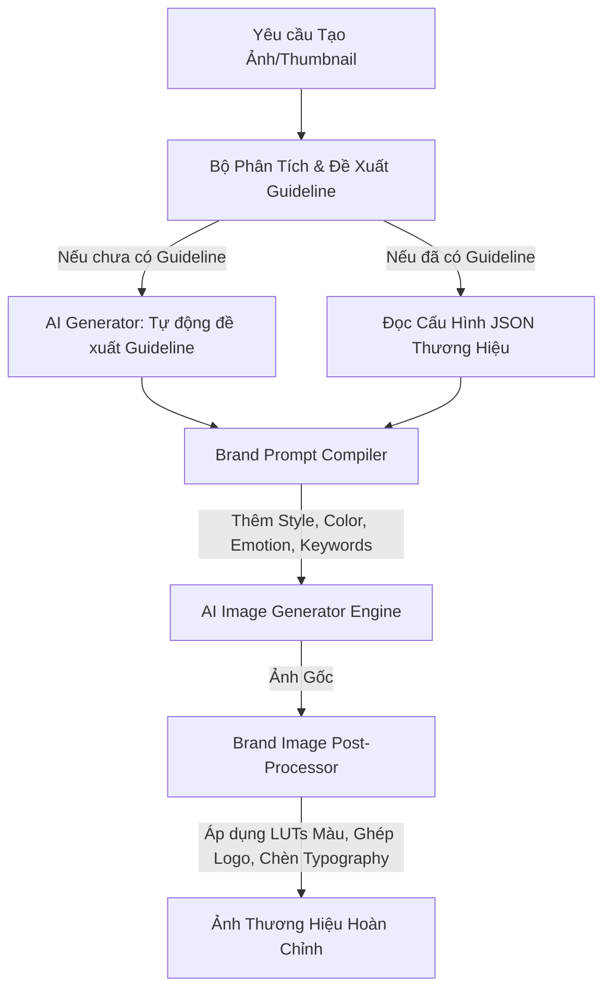

# Hệ Thống Quản Lý & Định Hình Hình Ảnh Thương Hiệu Tự Động (Brand Image Consistency System)

Hệ thống này được thiết kế nhằm đảm bảo mọi hình ảnh do AI tạo ra (AI-generated Images/Thumbnails) luôn tuân thủ nghiêm ngặt bộ nhận diện thương hiệu độc bản mà không cần lập trình cứng (hardcode). Hệ thống có khả năng tự động đề xuất tài liệu hướng dẫn thương hiệu (Brand Guideline) nếu doanh nghiệp chưa có sẵn, đồng thời tích hợp trực tiếp vào quy trình tạo prompt và hậu xử lý hình ảnh.

---

## 1. Kiến Trúc Tổng Quan (System Architecture)

Hệ thống bao gồm 3 khối chức năng cốt lõi hoạt động tuần tự:



1. **Khối Quản Lý & Đề Xuất Cấu Hình (Brand Profile Engine)**: Nạp cấu hình từ cơ sở dữ liệu hoặc file JSON. Nếu thiếu cấu hình, AI Agent sẽ sử dụng mô tả sản phẩm/doanh nghiệp để tự động sinh ra một bộ Brand Guideline tạm thời hoặc đề xuất bộ chính thức cho Admin phê duyệt.
2. **Khối Biên Dịch Prompt (Brand Prompt Compiler)**: Nhận prompt thô từ người dùng hoặc nội dung bài viết, sau đó tự động chuyển dịch, pha trộn các từ khóa thương hiệu, phong cách minh họa/chụp ảnh, tông màu chủ đạo và cảm xúc hướng đến vào cấu trúc prompt gửi cho AI Model (Midjourney, Stable Diffusion, Flux, DALL-E 3).
3. **Khối Hậu Xử Lý Nhận Diện (Brand Image Post-Processor)**: Nhận ảnh thô từ AI Engine và tiến hành các bước xử lý lớp phủ (overlay): định vị logo (Logo Position), áp bộ lọc màu chuẩn thương hiệu (Color Correction/LUTs), và render text (chữ tiêu đề) dựa trên phông chữ thương hiệu (Brand Typography).

---

## 2. Thiết Kế Cấu Trúc Dữ Liệu Động (Dynamic JSON Schema)

Để tránh lập trình cứng (hardcode), toàn bộ cấu hình thương hiệu được lưu trữ dưới dạng JSON động trong cơ sở dữ liệu (`brand_guidelines` table) với cấu trúc chuẩn hóa:

```json
{
  "brand_identity": {
    "name": "EcoSmart Home",
    "industry": "Smart Green Technology",
    "personality": "Chuyên nghiệp, Đổi mới, Thân thiện với môi trường, Đáng tin cậy",
    "emotion": "Truyền cảm hứng, An tâm, Hiện đại, Gần gũi",
    "keywords": ["eco-friendly", "futuristic minimalism", "clean energy", "smart living", "high-tech sustainability"]
  },
  "visual_style": {
    "illustration_style": "3D isometric claymation style, soft lighting, clean shapes, vector minimalism",
    "photography_style": "Commercial studio lighting, clean background, sharp focus, natural daylight shadows, premium cinematic look",
    "active_style": "photography" 
  },
  "color_palette": {
    "primary": "#2E7D32", 
    "secondary": "#81C784",
    "accent": "#FFB74D",
    "background_mood": "Warm white and soft green tones, avoiding high-contrast pitch blacks",
    "color_matching_weight": 0.85 
  },
  "typography": {
    "title_font": "Montserrat",
    "body_font": "Inter",
    "style": "Bold uppercase titles with high legibility, clean letter spacing"
  },
  "logo_config": {
    "logo_url": "/assets/brand/logo_white.png",
    "default_position": "top-right", 
    "margin_percent": 5, 
    "opacity": 0.9, 
    "max_width_ratio": 0.15 
  }
}
```

---

## 3. Cơ Chế Tự Động Đề Xuất Guideline (Proposal Engine)

Khi người dùng chưa thiết lập bộ nhận diện thương hiệu, hệ thống sẽ kích hoạt **Guideline Generator Agent**. Quy trình tự động đề xuất hoạt động như sau:

### Quy trình Đề xuất & Phê duyệt:
1. **Thu thập dữ liệu**: AI quét thông tin sơ bộ từ: Tên thương hiệu, Lĩnh vực hoạt động, Đối tượng khách hàng mục tiêu, và mô tả ngắn về sản phẩm/dịch vụ.
2. **Suy luận & Ánh xạ**:
   - Sử dụng LLM để ánh xạ lĩnh vực sang hệ màu tương thích (ví dụ: *Công nghệ & Sinh thái* -> xanh lục mạ crôm, trắng ấm; *Tài chính* -> xanh dương navy, vàng kim).
   - Đề xuất các cặp Font chữ Google Fonts tương ứng (như *Montserrat* cho hiện đại, *Playfair Display* cho sang trọng).
   - Chọn phong cách hình ảnh phù hợp (ví dụ: *SaaS Startup* -> 3D Isometric/Flat Vector; *F&B* -> Food photography cận cảnh, độ bão hòa cao).
3. **Phê duyệt**: Đưa bộ đề xuất hiển thị trên UI Dashboard để người dùng nhấn "Áp dụng và Lưu trữ".

### Prompt Mẫu Dành Cho AI Đề Xuất Guideline:
```text
Bạn là một Brand Identity Expert đẳng cấp quốc tế. Dựa trên thông tin doanh nghiệp sau:
- Tên thương hiệu: {{brand_name}}
- Ngành nghề: {{industry}}
- Mô tả ngắn: {{description}}

Hãy đề xuất bộ Brand Guideline định dạng JSON khớp chính xác với Schema quy định. Đảm bảo:
1. Palette màu phải có mã HEX rõ ràng, hài hòa về mặt mỹ thuật.
2. Từ khóa (keywords) và phong cách ảnh (illustration/photography style) phải tối ưu cho việc làm Prompt cho Midjourney/Flux.
3. Giải thích ngắn gọn lý do chọn các thành phần này.
```

---

## 4. Cơ Chế Biên Dịch Prompt Đúng Thương Hiệu (Brand Prompt Compiler)

Bộ dịch Prompt tự động chuyển đổi các yêu cầu tạo ảnh sơ sài của người dùng thành cấu trúc Prompt chuyên sâu kết hợp chặt chẽ bộ nhận diện thương hiệu.

### Công thức dựng Prompt:
$$\text{Final Prompt} = \text{User Request} + \text{Photography/Illustration Style} + \text{Color Tone & Lighting} + \text{Brand Emotion & Keywords} + \text{Negative Prompt Constraints}$$

### Mã nguồn minh họa (Python Engine):
```python
def compile_brand_prompt(user_prompt: str, guideline: dict) -> str:
    """
    Biên dịch prompt thô kết hợp với bộ hướng dẫn thương hiệu (guideline)
    """
    identity = guideline.get("brand_identity", {})
    visual = guideline.get("visual_style", {})
    colors = guideline.get("color_palette", {})
    
    # Xác định style chụp ảnh hay minh họa đang được kích hoạt
    active_style_key = visual.get("active_style", "photography")
    style_desc = visual.get(f"{active_style_key}_style", "")
    
    # Trích xuất các keywords thương hiệu và màu sắc chủ đạo
    brand_keywords = ", ".join(identity.get("keywords", []))
    color_desc = f"dominated by {colors.get('primary')} and {colors.get('secondary')} color accents, mood: {colors.get('background_mood')}"
    emotion_desc = f"conveying a feeling of {identity.get('emotion')}"
    
    # Kết hợp thành prompt tối ưu
    compiled_prompt = (
        f"{user_prompt}, {style_desc}, {color_desc}, "
        f"brand style: {brand_keywords}, {emotion_desc} --ar 16:9"
    )
    return compiled_prompt
```

---

## 5. Quy Trình Hậu Xử Lý Tự Động (Post-Processing Engine)

Sau khi ảnh thô được tạo ra từ AI Generator, hệ thống tiến hành áp dụng các lớp phủ kỹ thuật để đồng bộ nhận diện:

### 5.1 Áp Dụng Color LUTS (Color Matching)
- Sử dụng thư viện **OpenCV** hoặc **Pillow** để tự động căn chỉnh histogram của ảnh sinh ra tiệm cận với dải màu `primary` và `secondary` trong cấu hình thương hiệu.
- Đảm bảo độ bão hòa và tông màu không bị lệch pha so với màu sắc đại diện của thương hiệu (giảm thiểu tình trạng AI sinh ảnh quá chói hoặc sai lệch gam màu lạnh/ấm của thương hiệu).

### 5.2 Cơ Chế Định Vị & Đè Logo (Logo Watermarking)
Hệ thống tự động tính toán tọa độ chèn Logo dựa trên tham số `default_position`:
- **top-right**: $X = \text{Width} - \text{LogoWidth} - \text{Margin}$, $Y = \text{Margin}$
- **bottom-right**: $X = \text{Width} - \text{LogoWidth} - \text{Margin}$, $Y = \text{Height} - \text{LogoHeight} - \text{Margin}$
- **top-left**: $X = \text{Margin}$, $Y = \text{Margin}$
- **bottom-left**: $X = \text{Margin}$, $Y = \text{Height} - \text{LogoHeight} - \text{Margin}$

```python
from PIL import Image

def overlay_brand_logo(source_image_path: str, logo_image_path: str, position: str = "top-right", margin_pct: int = 5) -> Image.Image:
    """
    Tự động chèn Logo thương hiệu vào ảnh kết quả dựa trên cấu hình vị trí động
    """
    base_image = Image.open(source_image_path).convert("RGBA")
    logo = Image.open(logo_image_path).convert("RGBA")
    
    base_w, base_h = base_image.size
    margin_x = int(base_w * (margin_pct / 100))
    margin_y = int(base_h * (margin_pct / 100))
    
    # Resize logo tỉ lệ với chiều rộng ảnh gốc (tối đa 15% chiều rộng ảnh)
    max_logo_w = int(base_w * 0.15)
    logo_w, logo_h = logo.size
    scale_factor = max_logo_w / logo_w
    new_logo_w = max_logo_w
    new_logo_h = int(logo_h * scale_factor)
    logo = logo.resize((new_logo_w, new_logo_h), Image.Resampling.LANCZOS)
    
    # Tính toán tọa độ chèn logo
    if position == "top-right":
        pos_x = base_w - new_logo_w - margin_x
        pos_y = margin_y
    elif position == "bottom-right":
        pos_x = base_w - new_logo_w - margin_x
        pos_y = base_h - new_logo_h - margin_y
    elif position == "top-left":
        pos_x = margin_x
        pos_y = margin_y
    elif position == "bottom-left":
        pos_x = margin_x
        pos_y = base_h - new_logo_h - margin_y
    else:
        pos_x = base_w - new_logo_w - margin_x
        pos_y = margin_y
        
    # Tạo lớp overlay chứa logo và thực hiện blend
    overlay = Image.new("RGBA", base_image.size, (0, 0, 0, 0))
    overlay.paste(logo, (pos_x, pos_y), mask=logo)
    
    return Image.alpha_composite(base_image, overlay).convert("RGB")
```

### 5.3 Áp Dụng Font Chữ Thương Hiệu (Typography Rendering)
- Khi Thumbnail cần hiển thị Text tiêu đề, hệ thống sẽ sử dụng thư viện vẽ chữ (ví dụ: `PIL.ImageDraw.Draw.text` với đường dẫn file TrueType Font `.ttf` tương ứng với phông chữ thương hiệu được tải về từ Google Fonts).
- Hệ thống tự động tính toán kích thước chữ động (dynamic font sizing) và đổ bóng/tạo viền chữ để đảm bảo chữ luôn nổi bật trên bất kỳ nền ảnh nào mà vẫn đúng Typography chuẩn thương hiệu.

---

## 6. Giao Diện Quản Lý Thương Hiệu Trên Hệ Thống (UI Design Concept)

Hệ thống cung cấp một bảng quản trị trực quan gồm:
1. **Visual Preview**: Hiển thị mô phỏng một bức ảnh có chèn logo và áp tông màu thương hiệu thực tế ngay khi cấu hình thay đổi.
2. **Proposal Wizard**: Nút bấm "Tự động Đề xuất bộ nhận diện" kích hoạt AI phân tích và tự điền các trường thông tin.
3. **Typography Selector**: Kết nối trực tiếp API Google Fonts giúp người dùng chọn font tiêu đề và font nội dung một cách trực quan.

---
*Tài liệu này đóng vai trò kiến trúc thiết kế chuẩn cho việc xây dựng tính năng Brand Alignment trong Module AI Image/Thumbnail Generator.*
