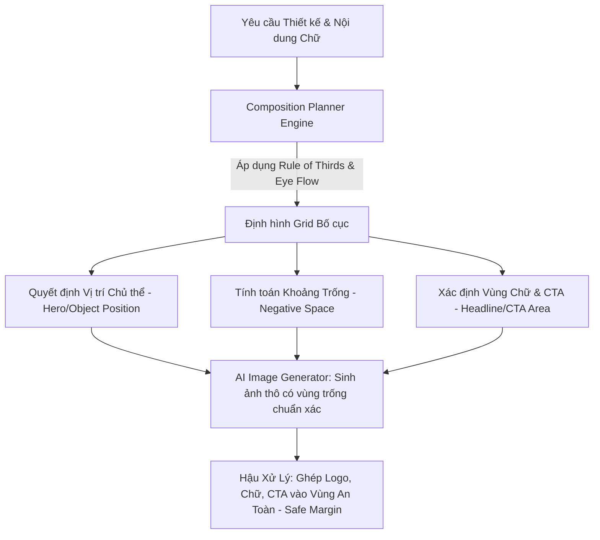

# Thiết Kế Composition Engine: Kiến Trúc Định Hình Bố Cục Hình Ảnh & Thumbnail Tự Động

Để đảm bảo các hình ảnh và ảnh thu nhỏ (Thumbnail) do AI sinh ra luôn đạt chuẩn mỹ thuật cao, có chiều sâu và tối ưu hóa tỷ lệ chuyển đổi, **Composition Engine** (Bộ máy định hình bố cục) được thiết kế nhằm áp dụng các nguyên lý thiết kế thị giác kinh điển vào quy trình sinh ảnh và hậu xử lý, loại bỏ hoàn toàn yếu tố bố cục ngẫu nhiên từ AI gốc.

---

## 1. Nguyên Lý Hoạt Động Tổng Quan (Core Concept)

Composition Engine hoạt động như một bộ khung quy tắc thị giác (Visual Grid & Layout Constraints). Nó phân tích mục tiêu thiết kế (Ví dụ: banner quảng cáo, ảnh bìa bài viết, thumbnail chia sẻ mạng xã hội) và nội dung chữ cần chèn để quyết định trước cấu trúc bố cục lý tưởng trước khi gửi prompt tạo hình ảnh hoặc ghép chữ.



---

## 2. Các Thành Phần Định Hình Bố Cục (Composition Parameters)

Hệ thống định nghĩa các tham số bố cục cốt lõi dưới dạng ma trận tọa độ tương đối (Relative Grid) từ $0.0$ đến $1.0$ (phù hợp với mọi kích thước và tỷ lệ khung hình):

| Tham số bố cục | Vai trò và Mô tả mỹ thuật | Cách thức kiểm soát |
| :--- | :--- | :--- |
| **Hero / Object Position** | Vị trí đặt nhân vật hoặc sản phẩm chính (Chủ thể). | Định vị tại các điểm giao nhau (Power Points) của lưới 1/3 để thu hút ánh mắt tức thì. |
| **Negative Space** | Khoảng không gian trống hoặc mờ mịn. | Cực kỳ quan trọng để mắt người xem có không gian nghỉ ngơi và là vị trí lý tưởng để chèn Headline. |
| **Headline Area** | Khu vực hiển thị tiêu đề chính. | Phải nằm ở vùng có độ tương phản cao, ít chi tiết nhiễu để đảm bảo tính dễ đọc (Legibility). |
| **CTA Area** | Khu vực hiển thị nút hành động (Call To Action). | Thường đặt ở góc dưới cùng bên phải hoặc chính giữa phía dưới của Headline. |
| **Logo Area** | Khu vực đặt logo thương hiệu. | Luôn đặt ở góc cố định (như góc trên cùng bên phải) nằm trong Safe Margin để tránh đè lên chủ thể. |
| **Safe Margin** | Vùng biên an toàn (thường là 5% đến 8% từ viền ngoài). | Đảm bảo logo, text và thông tin quan trọng không bị cắt mất khi hiển thị trên các thiết bị hoặc nền tảng khác nhau. |
| **Eye Flow (Luồng mắt đọc)** | Định hướng đường đi của ánh nhìn người xem. | Áp dụng luồng đọc chữ Z (Z-Pattern) cho bố cục ít chữ/nhiều ảnh hoặc luồng chữ F (F-Pattern) cho bố cục nhiều thông tin. |
| **Rule of Thirds (Quy tắc 1/3)** | Chia khung hình thành lưới 9 phần bằng nhau. | Neo các chi tiết quan trọng (mắt nhân vật, logo sản phẩm) tại 4 giao điểm vàng. |
| **Depth (Chiều sâu)** | Tạo lớp tiền cảnh (Foreground), trung cảnh (Midground), hậu cảnh (Background). | Sử dụng hiệu ứng mờ (bokeh) cho hậu cảnh và đặt chủ thể rõ nét ở trung cảnh để tạo chiều sâu 3D. |
| **Business Style** | Phong cách bố cục đặc trưng cho từng loại hình doanh nghiệp. | Doanh nghiệp B2B chuộng bố cục tối giản đối xứng; B2C sáng tạo chuộng bố cục bất đối xứng, năng động. |

---

## 3. Thư Viện Mẫu Bố Cục Chuẩn Hóa (Preset Layout Library)

Không hardcode. Hệ thống lưu trữ các mẫu bố cục mẫu (Dynamic Layout Presets) dưới dạng cấu hình JSON để Engine tự động truy xuất dựa trên ngữ cảnh:

```json
{
  "presets": [
    {
      "name": "Left_Hero_Right_Text",
      "description": "Chủ thể nằm bên trái, tiêu đề và CTA nằm bên phải. Rất phù hợp cho quảng cáo dịch vụ/SaaS.",
      "grid": {
        "hero_position": { "x_range": [0.05, 0.45], "y_range": [0.1, 0.9] },
        "negative_space": { "x_range": [0.5, 0.95], "y_range": [0.1, 0.9] },
        "headline_area": { "x_range": [0.55, 0.9], "y_range": [0.2, 0.5] },
        "cta_area": { "x_range": [0.55, 0.8], "y_range": [0.6, 0.75] },
        "logo_area": { "x_range": [0.8, 0.95], "y_range": [0.05, 0.15] }
      },
      "eye_flow": "Z-pattern",
      "depth_focus": "midground_sharp",
      "safe_margin_pct": 5
    },
    {
      "name": "Centered_Minimalist",
      "description": "Bố cục đối xứng tập trung. Phù hợp cho giới thiệu sản phẩm cao cấp, thời trang, thiết bị công nghệ.",
      "grid": {
        "hero_position": { "x_range": [0.3, 0.7], "y_range": [0.3, 0.85] },
        "negative_space": { "x_range": [0.05, 0.95], "y_range": [0.05, 0.95] },
        "headline_area": { "x_range": [0.1, 0.9], "y_range": [0.1, 0.25] },
        "cta_area": { "x_range": [0.35, 0.65], "y_range": [0.85, 0.93] },
        "logo_area": { "x_range": [0.05, 0.2], "y_range": [0.05, 0.12] }
      },
      "eye_flow": "O-pattern (Focus Center)",
      "depth_focus": "background_blurred",
      "safe_margin_pct": 6
    }
  ]
}
```

---

## 4. Cơ Chế Điều Khiển AI Sinh Ảnh Đúng Bố Cục (Prompt Compilation Control)

Để ép AI Generator (Flux, Midjourney, Stable Diffusion) sinh ra ảnh có bố cục chính xác theo Preset mong muốn, Composition Engine sẽ biên dịch các tọa độ không gian thành các chỉ dẫn mô tả bố cục rõ ràng trong Prompt.

### Ví dụ biên dịch bố cục cho Preset `Left_Hero_Right_Text`:
- **Chỉ thị Bố cục (Layout Instruction)**: "A professional business consultant standing on the left side of the frame, looking towards the right side."
- **Chỉ thị Vùng Trống (Negative Space Instruction)**: "The right half of the image is a clean, minimal office wall with soft shadows, completely empty and clean, perfect for text overlay."
- **Chỉ thị Chiều sâu (Depth Instruction)**: "Shallow depth of field, background subtly out of focus, premium corporate lighting."

**Prompt kết quả gửi lên AI**:
> "A professional business consultant standing on the left side of the frame, looking towards the right side. The right half of the image is a clean, minimal office wall with soft shadows, completely empty and clean, perfect for text overlay. Shallow depth of field, background subtly out of focus, premium corporate lighting, clean and modern business style."

---

## 5. Giải Thuật Hậu Xử Lý Tự Động (Post-Processing Layout Matcher)

Sau khi ảnh được tạo ra, thuật toán hậu xử lý sẽ căn chỉnh các phần tử đồ họa (Text, CTA, Logo) vào đúng tọa độ pixel trên thực tế:

```python
def calculate_absolute_coordinates(image_width: int, image_height: int, relative_box: dict, safe_margin_pct: int) -> dict:
    """
    Tính toán tọa độ pixel thực tế cho các phần tử đồ họa dựa trên cấu hình Safe Margin
    """
    margin_x = int(image_width * (safe_margin_pct / 100))
    margin_y = int(image_height * (safe_margin_pct / 100))
    
    # Giới hạn vùng vẽ khả dụng bên trong Safe Margin
    min_x = margin_x
    max_x = image_width - margin_x
    min_y = margin_y
    max_y = image_height - margin_y
    
    x_range = relative_box.get("x_range", [0, 1])
    y_range = relative_box.get("y_range", [0, 1])
    
    # Ánh xạ tọa độ tương đối sang tọa độ pixel thực tế
    abs_x1 = int(min_x + (max_x - min_x) * x_range[0])
    abs_x2 = int(min_x + (max_x - min_x) * x_range[1])
    abs_y1 = int(min_y + (max_y - min_y) * y_range[0])
    abs_y2 = int(min_y + (max_y - min_y) * y_range[1])
    
    return {
        "x": abs_x1,
        "y": abs_y1,
        "width": abs_x2 - abs_x1,
        "height": abs_y2 - abs_y1
    }
```

---
*Tài liệu thiết kế này định hình kiến trúc xử lý bố cục mỹ thuật tự động, giúp nâng cao tính nhất quán và tính thẩm mỹ của mọi ấn phẩm truyền thông được tạo ra bởi AI Marketing Platform.*
