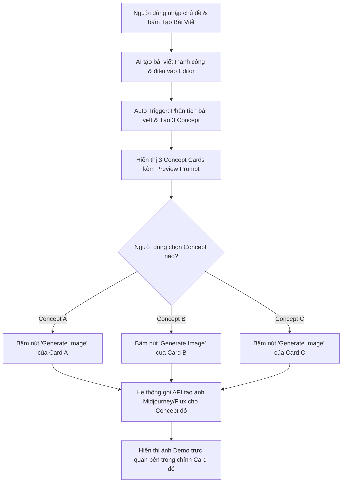

# 🎨 ĐẶC TẢ THIẾT KẾ UI/UX: AI CREATIVE CONCEPTS
## Content Studio Workspace Redesign — Marketing SaaS Style

> **Vai trò**: Senior UX Designer  
> **Dự án**: AI_Agent_Content_AutoPos  
> **Tài liệu đặc tả**: `CREATIVE_CONCEPT_UI.md`  
> **Trạng thái**: Sẵn sàng tích hợp  

---

## 1. 🎯 Tầm Nhìn UX & Định Hướng Thiết Kế (Design System)

Tái thiết kế giao diện **Content Studio Workspace** nhằm tích hợp phần mới **AI Creative Concepts** sau khi AI sinh bài viết thành công. Mục tiêu là giúp nhà tiếp thị (marketer) có một không gian làm việc liền mạch: từ ý tưởng viết bài, biên tập nội dung, đến việc lên ý tưởng hình ảnh (thumbnail) và tạo ảnh bằng AI chỉ trên một màn hình duy nhất.

### Triết lý thiết kế Marketing SaaS cao cấp:
*   **Vibrant Color Palette & Gradients**: Sử dụng các dải màu gradient hiện đại để phân biệt rõ ràng tính năng và các Concept (Concept A, B, C).
*   **Visual Hierarchy (Phân cấp thị giác)**: Tiêu đề rõ ràng, các thông số kỹ thuật được đặt trong các thẻ/badge gọn gàng, các nút hành động (CTA) nổi bật và có độ tương phản cao.
*   **Sạch sẽ & Khoảng cách hợp lý (Whitespace)**: Tăng khoảng trống đệm (`padding: 1.5rem` đến `2rem`, `gap: 1.5rem`) để tránh hiện tượng quá tải thông tin (information overload).
*   **Responsive Grid**: Bố cục tự động co giãn tối ưu trên cả màn hình Desktop lớn (Split-Screen 50/50 hoặc 60/40) và máy tính bảng/thiết bị di động (1 cột dọc).
*   **Micro-interactions**: Hiệu ứng hover mượt mà cho các Concept Cards (đổ bóng sâu hơn, viền phát sáng nhẹ) tạo cảm giác giao diện "sống động".

---

## 2. 📐 Sơ Đồ Bố Cục Không Gian Làm Việc (Layout Wireframe)

Giao diện Workspace được chia thành **2 cột chính (Split-Screen)** trên màn hình lớn để tối ưu không gian làm việc song song:

```
┌────────────────────────────────────────────────────────────────────────────────────────┐
│  Navbar / Breadcrumbs: Workspaces > Content Studio Workspace                           │
├────────────────────────────────────────────────────────┬───────────────────────────────┤
│                                                        │                               │
│  📝 CỘT TRÁI: EDITOR & INPUT PANEL (50%)               │  👁️ CỘT PHẢI: PREVIEW & CONCEPT (50%) │
│                                                        │                               │
│  ┌──────────────────────────────────────────────────┐  │  ┌─────────────────────────┐  │
│  │ ✨ AI Create | ✍️ Framework | 📂 Brand Brain     │  │  │ Tab: 📱 Live Preview    │  │
│  └──────────────────────────────────────────────────┘  │  ├─────────────────────────┤  │
│  ┌──────────────────────────────────────────────────┐  │  │ Tab: 🎨 Creative Concepts [ACTIVE]  │
│  │ Input: Chủ đề, Khách hàng mục tiêu, Nền tảng...   │  │  └─────────────────────────┘  │
│  │ [🚀 Sinh bài viết bằng AI]                       │  │  ┌─────────────────────────┐  │
│  └──────────────────────────────────────────────────┘  │  │ ⚡ AI Creative Concepts  │  │
│                                                        │  │ "Phân tích từ bài viết" │  │
│  ┌──────────────────────────────────────────────────┐  │  └─────────────────────────┘  │
│  │ Tiêu đề bài viết: [............................] │  │  ┌─────────────────────────┐  │
│  ├──────────────────────────────────────────────────┤  │  │  🏢 Concept A           │  │
│  │ Editor (Markdown):                               │  │  │  (Business Professional)│  │
│  │                                                  │  │  ├─────────────────────────┤  │
│  │ - Nội dung bài đăng tự động điền vào đây...      │  │  │  Ví dụ ảnh mô phỏng     │  │
│  │                                                  │  │  ├─────────────────────────┤  │
│  │                                                  │  │  │  🎬 Concept B           │  │
│  │                                                  │  │  │  (Cinematic Story)      │  │
│  │                                                  │  │  ├─────────────────────────┤  │
│  │                                                  │  │  │  📊 Concept C           │  │
│  │                                                  │  │  │  (Infographic/Data)     │  │
│  └──────────────────────────────────────────────────┘  │  └─────────────────────────┘  │
│  ┌──────────────────────────────────────────────────┐  │                               │
│  │ [💾 Lưu bản nháp] [🧠 Lưu Tri thức] [🚀 Duyệt]   │  │                               │
│  └──────────────────────────────────────────────────┘  │                               │
└────────────────────────────────────────────────────────┴───────────────────────────────┘
```

---

## 3. 🎴 Thiết Kế Chi Tiết Concept Card (A, B, C)

Mỗi concept đại diện cho một trường phái marketing khác nhau và được trình bày trong một **Thẻ Độc Lập (Card)** được thiết kế tỉ mỉ.

### 🏢 Thẻ Concept A: Business Professional (Uy tín & Chuyên nghiệp)
*   **Màu chủ đạo**: Gradient Navy Blue & Royal Blue (`#004ac6` → `#2563eb`).
*   **Đặc trưng**: Thích hợp cho LinkedIn và Facebook Business, nhắm vào các CEO, quản lý.

### 🎬 Thẻ Concept B: Cinematic Storytelling (Điện ảnh & Cảm xúc)
*   **Màu chủ đạo**: Gradient Deep Purple & Electric Violet (`#7c3aed` → `#a855f7`).
*   **Đặc trưng**: Tăng tỷ lệ CTR mạnh mẽ trên Facebook, Instagram, YouTube.

### 📊 Thẻ Concept C: Infographic / Data Driven (Số liệu & Giáo dục)
*   **Màu chủ đạo**: Gradient Emerald Green & Mint (`#059669` → `#10b981`).
*   **Đặc trưng**: Thúc đẩy hành vi Lưu trữ (Save) và Chia sẻ (Share) trên LinkedIn, Pinterest.

---

### 📋 Cấu Trúc Các Trường Thông Tin Trong Mỗi Card

Mỗi Concept Card phải hiển thị đầy đủ và trực quan 10 trường/hành động sau đây:

| STT | Tên Trường | Định dạng hiển thị | Mô tả trải nghiệm người dùng (UX) |
|---|---|---|---|
| **1** | **Concept Name** | Badge + Tiêu đề lớn | Tên Concept kèm theo phong cách trực quan chủ đạo (Ví dụ: *Concept A — Business Professional*). |
| **2** | **Marketing Goal** | Ký hiệu Target 🎯 + Văn bản | Mục tiêu tiếp thị cốt lõi của ảnh (Xây dựng uy tín, Tăng CTR, hay Giáo dục độc giả). |
| **3** | **Visual Story** | Ký hiệu Image 🖼️ + Mô tả dài | Mô tả chi tiết phân cảnh hình ảnh: Ai làm gì, bối cảnh, ánh sáng, góc chụp. |
| **4** | **Headline** | Ký hiệu Text ✍️ + Dưới dạng thẻ trích dẫn | Tiêu đề đề xuất (không quá 7 từ) hiển thị trên ảnh thumbnail để tạo điểm nhấn thị giác. |
| **5** | **Mô tả ngắn** | Thẻ văn bản mô tả | Tóm tắt ý tưởng nghệ thuật và phong cách thể hiện trong 1-2 câu ngắn gọn. |
| **6** | **Business Value** | Ký hiệu Dollar 💡 + Nền màu dịu | Giá trị thực tế đối với chuyển đổi kinh doanh (Ví dụ: tại sao đối tượng CEO lại click vào ảnh này). |
| **7** | **Preview Prompt** | Hộp Code thu gọn (Expander) | Prompt tiếng Anh tối ưu hóa sẵn cho Midjourney/Flux/DALL-E 3 để tạo ra hình ảnh này. |
| **8** | **Generate Image** | Nút CTA nổi bật (Primary Accent) | **Không sinh ảnh tự động**. Người dùng click nút này để gửi yêu cầu sinh ảnh thực tế từ Prompt. |
| **9** | **Copy Prompt** | Nút Icon hành động phụ | Sao chép nhanh prompt tạo ảnh để dán sang các ứng dụng tạo ảnh bên ngoài. |
| **10** | **Regenerate** | Nút Icon Refresh 🔄 | Yêu cầu AI viết lại Concept cụ thể này nếu người dùng muốn thay đổi phong cách nghệ thuật. |

---

## 4. 💻 Đặc Tả Thiết Kế Giao Diện (CSS & HTML Mockup)

Dưới đây là mã CSS và cấu trúc HTML tùy chỉnh để xây dựng giao diện Concept Card chuẩn SaaS hiện đại trên Streamlit hoặc bất kỳ Framework Web nào:

### 🎨 Thư viện Tokens & CSS (Dán vào phần Style)
```css
/* Container tổng của Concept Studio */
.concept-workspace-container {
    padding: 1.5rem;
    background-color: #ffffff;
    border-radius: 16px;
    border: 1px solid #f1f5f9;
}

/* Thiết kế Thẻ Concept chính */
.concept-card {
    background: #ffffff;
    border: 1px solid #e2e8f0;
    border-radius: 16px;
    padding: 1.75rem;
    margin-bottom: 1.5rem;
    position: relative;
    overflow: hidden;
    box-shadow: 0 4px 6px -1px rgba(0, 0, 0, 0.05), 0 2px 4px -1px rgba(0, 0, 0, 0.025);
    transition: all 0.3s cubic-bezier(0.4, 0, 0.2, 1);
}

.concept-card:hover {
    transform: translateY(-2px);
    box-shadow: 0 12px 24px -4px rgba(0, 74, 198, 0.08), 0 4px 12px -2px rgba(0, 74, 198, 0.03);
    border-color: #cbd5e1;
}

/* Các sọc màu Gradient trên đỉnh của mỗi card */
.concept-stripe-a {
    position: absolute;
    top: 0; left: 0; right: 0; height: 5px;
    background: linear-gradient(90deg, #004ac6, #2563eb);
}
.concept-stripe-b {
    position: absolute;
    top: 0; left: 0; right: 0; height: 5px;
    background: linear-gradient(90deg, #7c3aed, #a855f7);
}
.concept-stripe-c {
    position: absolute;
    top: 0; left: 0; right: 0; height: 5px;
    background: linear-gradient(90deg, #059669, #10b981);
}

/* Thiết kế Badge hiển thị Concept */
.concept-badge-a {
    background: linear-gradient(135deg, rgba(0, 74, 198, 0.1) 0%, rgba(37, 99, 235, 0.1) 100%);
    color: #004ac6;
    border: 1px solid rgba(0, 74, 198, 0.2);
    border-radius: 9999px;
    padding: 6px 16px;
    font-size: 0.8rem;
    font-weight: 700;
    display: inline-flex;
    align-items: center;
    gap: 6px;
    letter-spacing: 0.5px;
}

.concept-badge-b {
    background: linear-gradient(135deg, rgba(124, 58, 237, 0.1) 0%, rgba(168, 85, 247, 0.1) 100%);
    color: #7c3aed;
    border: 1px solid rgba(124, 58, 237, 0.2);
    border-radius: 9999px;
    padding: 6px 16px;
    font-size: 0.8rem;
    font-weight: 700;
    display: inline-flex;
    align-items: center;
    gap: 6px;
    letter-spacing: 0.5px;
}

.concept-badge-c {
    background: linear-gradient(135deg, rgba(5, 150, 105, 0.1) 0%, rgba(16, 185, 129, 0.1) 100%);
    color: #059669;
    border: 1px solid rgba(5, 150, 105, 0.2);
    border-radius: 9999px;
    padding: 6px 16px;
    font-size: 0.8rem;
    font-weight: 700;
    display: inline-flex;
    align-items: center;
    gap: 6px;
    letter-spacing: 0.5px;
}

/* Các trường thông tin bên trong Card */
.concept-title {
    font-size: 1.2rem;
    font-weight: 700;
    color: #0f172a;
    margin-top: 0.75rem;
    margin-bottom: 0.5rem;
}

.concept-field-label {
    font-weight: 600;
    color: #475569;
    font-size: 0.85rem;
    text-transform: uppercase;
    letter-spacing: 0.5px;
    margin-bottom: 0.25rem;
}

.concept-field-value {
    color: #0f172a;
    font-size: 0.95rem;
    line-height: 1.5;
    margin-bottom: 1rem;
}

/* Trích dẫn cho Headline */
.concept-headline-box {
    background-color: #f8fafc;
    border-left: 4px solid #cbd5e1;
    padding: 0.75rem 1rem;
    font-style: italic;
    font-weight: 700;
    color: #1e293b;
    font-size: 1.05rem;
    border-radius: 0 8px 8px 0;
    margin-bottom: 1rem;
}

/* Thẻ giá trị doanh nghiệp nổi bật */
.concept-value-box {
    background-color: #f0fdf4;
    border: 1px solid #bbf7d0;
    color: #166534;
    padding: 0.75rem 1rem;
    border-radius: 8px;
    font-size: 0.9rem;
    font-weight: 500;
    margin-bottom: 1.25rem;
}

/* Prompt Expander */
.prompt-expander {
    border: 1px dashed #cbd5e1;
    background-color: #fafafa;
    border-radius: 8px;
    padding: 0.75rem;
    margin-bottom: 1.25rem;
}
```

---

## 5. 🔄 Quy Trình Tương Tác & Quản Lý Trạng Thái (User Flow & State)

Để đảm bảo hiệu suất tốt nhất và tiết kiệm tài nguyên API, cơ chế tạo ảnh tuân thủ các bước sau:



### Chi tiết hành động tại mỗi Concept Card:
1.  **Nhấn "Generate Image"**:
    *   Nút chuyển sang trạng thái loading: `🔄 Đang tạo ảnh minh họa...`
    *   Gọi API tạo ảnh chỉ cho concept đó.
    *   Sau khi thành công, hình ảnh được hiển thị ở phần cuối của Card với tùy chọn `Đính kèm bài viết` hoặc `Tải về máy`.
2.  **Nhấn "Regenerate"**:
    *   Gửi lại nội dung bài viết và yêu cầu AI làm mới ý tưởng chỉ riêng cho Concept này (giữ nguyên các Concept khác để tránh mất dữ liệu).

---

## 6. 🛠️ Hướng Dẫn Tích Hợp Vào Mã Nguồn

Khi triển khai phần giao diện này vào file [tab_content_studio_workspace.py](file:///e:/Save%20APP/AI_Agent_Content_AutoPos/ui/tab_content_studio_workspace.py) thuộc Streamlit, cấu trúc code sẽ được bố trí như sau:

```python
# Ví dụ triển khai UI của 1 Card (Concept A)
def render_concept_card(concept_id, concept_data, workspace_id, gemini_key):
    # Dùng Container bọc quanh để định hình Card
    with st.container():
        # Render tiêu đề và sọc màu bằng HTML
        st.markdown(f"""
        <div class="concept-card">
            <div class="concept-stripe-a"></div>
            <span class="concept-badge-a">🏢 CONCEPT {concept_id} — {concept_data['name']}</span>
        </div>
        """, unsafe_allow_html=True)
        
        # Sắp xếp các trường thông tin
        st.markdown(f"**🎯 Marketing Goal:** {concept_data['marketing_goal']}")
        st.markdown(f"**🖼️ Visual Story:** {concept_data['visual_story']}")
        
        # Hiển thị Headline nổi bật
        st.markdown(f"""
        <div class="concept-headline-box">
            "{concept_data['headline']}"
        </div>
        """, unsafe_allow_html=True)
        
        st.markdown(f"**📝 Mô tả ngắn:** {concept_data['short_description']}")
        
        # Hiển thị Business Value nổi bật
        st.markdown(f"""
        <div class="concept-value-box">
            💡 <b>Business Value:</b> {concept_data['business_value']}
        </div>
        """, unsafe_allow_html=True)
        
        # Prompt Expander
        with st.expander("👁️ Xem Preview Prompt tạo ảnh"):
            st.code(concept_data['preview_prompt'], language="text")
            
        # Các nút bấm hành động (Hàng ngang hợp lý)
        col1, col2, col3 = st.columns([2, 1, 1])
        with col1:
            if st.button("🖼️ Generate Image", key=f"gen_img_{concept_id}_{workspace_id}", type="primary"):
                # Logic sinh ảnh thủ công ở đây
                with st.spinner("AI đang tạo ảnh..."):
                    image_url = run_image_generation_service(concept_data['preview_prompt'])
                    st.image(image_url, caption="Ảnh AI tạo ra")
        with col2:
            if st.button("📋 Copy Prompt", key=f"copy_p_{concept_id}_{workspace_id}"):
                copy_to_clipboard(concept_data['preview_prompt'])
                st.success("Đã copy prompt!")
        with col3:
            if st.button("🔄 Regenerate", key=f"regen_{concept_id}_{workspace_id}"):
                # Logic viết lại concept này
                regenerate_single_concept(concept_id)
```

---
*Tài liệu thiết kế bởi Senior UX Designer thuộc Antigravity AI Team*
