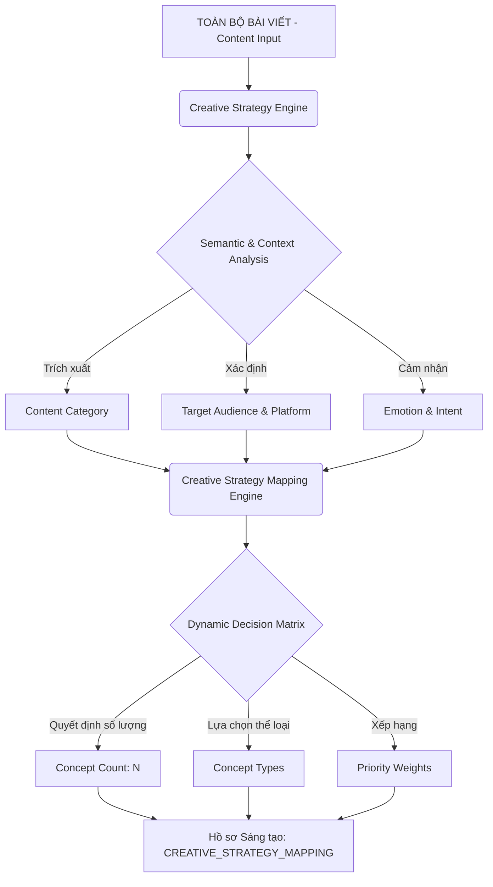

# 🧠 CREATIVE STRATEGY MAPPING — BẢN ĐỒ CHIẾN LƯỢC SÁNG TẠO TỰ ĐỘNG

> **Phiên bản**: 1.0  
> **Vai trò thiết kế**: Creative Director · Principal AI Brand Strategist · AI Marketing Consultant  
> **Dự án**: AI_Agent_Content_AutoPos  
> **Tệp cấu hình đầu ra**: `CREATIVE_STRATEGY_MAPPING.md`  

---

## 1. 🎯 Tổng Quan & Định Hướng Mỹ Thuật (Creative Vision)

Trong vai trò **Creative Director**, việc đồng nhất giữa **Định dạng nội dung (Content Category)** và **Ý tưởng hình ảnh (Creative Concept)** là yếu tố sống còn quyết định tỷ lệ nhấp chuột (CTR) và mức độ chuyển đổi (Conversion). Một bài viết kỹ thuật không thể đi kèm hình ảnh kịch tính rẻ tiền, và ngược lại, một tin tức nóng hổi không thể minh họa bằng một bức ảnh chân dung lãnh đạo tĩnh lặng.

Để giải quyết triệt để vấn đề này, **Creative Strategy Engine (CSE)** không áp dụng một công thức tĩnh hay một bộ quy tắc hardcode cố định 3 Concept cho mọi bài viết. Thay vào đó, Engine tự động đưa ra các quyết định động về:
1. **Số lượng Concept tối ưu** (không giới hạn ở con số 3, có thể là 2, 4 hoặc 5 tùy thuộc vào độ phức tạp và đa dạng góc nhìn của bài viết).
2. **Lựa chọn các Creative Concept cụ thể** phù hợp nhất từ thư viện chiến lược.
3. **Thứ tự ưu tiên (Priority & Weighted Score)** để tối ưu hóa hiệu quả hiển thị đa kênh.

---

## 2. 🗺️ Sơ Đồ Ánh Xạ Chiến Lược (Strategy Mapping Diagram)

Dưới đây là sơ đồ dòng chảy quyết định từ phân tích ngữ nghĩa nội dung đến việc tự động đề xuất tổ hợp Creative Concept tối ưu:



---

## 3. 📂 Thư Viện Concept & Bộ Ánh Xạ Mẫu (Strategic Mapping Library)

Dưới đây là các kịch bản ánh xạ chuẩn hóa cho các nhóm nội dung phổ biến, thể hiện khả năng tùy biến động của hệ thống:

### 🏢 Nhóm 1: Case Study (Nghiên cứu tình huống thực tế)
* **Visual Direction**: Tạo dựng niềm tin tuyệt đối, trực quan hóa kết quả thực chứng, đĩnh đạc và chuyên nghiệp.
* **Tổ hợp Concept Động Đề Xuất**:
  ```
  [Content Category: Case Study]
         │
         ├───► Concept 1 [Độ ưu tiên: 50%]: Business Professional (Before - After)
         │     └── Bố cục Split-Screen hoặc Dashboard KPI, bối cảnh văn phòng hiện đại.
         │
         ├───► Concept 2 [Độ ưu tiên: 30%]: Corporate Office Hero Shot
         │     └── Chân dung chuyên gia hoặc nhóm cộng sự đang phân tích biểu đồ tăng trưởng.
         │
         └───► Concept 3 [Độ ưu tiên: 20%]: Minimalist Framework
               └── Biểu đồ mũi tên đi lên hoặc sơ đồ đòn bẩy đơn giản, tối giản.
  ```

### 📖 Nhóm 2: Tutorial / Educational (Hướng dẫn kỹ thuật / Giáo dục)
* **Visual Direction**: Rõ ràng, dễ hiểu, khơi gợi hành động thực tế, kích thích lưu giữ và chia sẻ.
* **Tổ hợp Concept Động Đề Xuất**:
  ```
  [Content Category: Tutorial]
         │
         ├───► Concept 1 [Độ ưu tiên: 40%]: Step-by-Step Flowchart
         │     └── Sơ đồ các bước thực hiện rõ ràng, nền phẳng sáng.
         │
         ├───► Concept 2 [Độ ưu tiên: 35%]: Checklist & Infographic Grid
         │     └── Danh sách các đầu việc cần kiểm tra kèm icon phẳng hiện đại.
         │
         └───► Concept 3 [Độ ưu tiên: 25%]: Hands-on Tech Workspace
               └── Bối cảnh bàn làm việc thực tế với máy tính hiển thị code/giao diện thiết kế.
  ```

### ⚡ Nhóm 3: Breaking News / Hot Trends (Tin tức nóng hổi / Xu hướng)
* **Visual Direction**: Kịch tính, tốc độ, thu hút thị giác cực mạnh để tăng CTR (Click-Through Rate).
* **Tổ hợp Concept Động Đề Xuất**:
  ```
  [Content Category: Breaking News]
         │
         ├───► Concept 1 [Độ ưu tiên: 45%]: Magazine Cover Style
         │     └── Thiết kế dạng bìa báo hiện đại với tiêu đề lớn nổi bật đè lên ảnh.
         │
         ├───► Concept 2 [Độ ưu tiên: 35%]: Cinematic High-Contrast Action
         │     └── Hình ảnh kịch tính với tông màu xanh lạnh pha cam nóng (Teal & Orange).
         │
         └───► Concept 3 [Độ ưu tiên: 20%]: News Style Splitted Layout
               └── Bố cục chia hai nửa, một nửa là sự kiện nóng, nửa còn lại là tiêu đề cảnh báo.
  ```

### 👑 Nhóm 4: CEO Insight / Thought Leadership (Góc nhìn lãnh đạo)
* **Visual Direction**: Sang trọng, quyền lực nhưng dễ tiếp cận, tối giản hóa tối đa để làm nổi bật thông điệp.
* **Tổ hợp Concept Động Đề Xuất**:
  ```
  [Content Category: CEO Insight]
         │
         ├───► Concept 1 [Độ ưu tiên: 60%]: Portrait Leadership Quote
         │     └── Chân dung trắng đen (hoặc màu trầm ấm) góc chụp hẹp, khoảng trống lớn chứa trích dẫn.
         │
         └───► Concept 2 [Độ ưu tiên: 40%]: Executive Office Minimalist
               └── Bối cảnh văn phòng C-level cao cấp góc rộng, tập trung vào chiều sâu không gian tĩnh lặng.
  ```

---

## 4. ⚙️ Thiết Kế Quy Tắc Động Cho Creative Strategy Engine (Dynamic Decision Rules)

Để công cụ AI Agent tự động quyết định cấu trúc concept mà không bị bó hẹp trong các danh sách tĩnh, Creative Strategy Engine hoạt động dựa trên các tham số động:

### 4.1. Quy tắc xác định số lượng Concept (N-Concept Decision Rule)
Số lượng concept được đề xuất dao động từ $2 \le N \le 5$, phụ thuộc vào các điều kiện sau:
* **N = 2**: Khi bài viết có tính tập trung cực kỳ cao (ví dụ: Thông cáo báo chí nội bộ hoặc Thư ngỏ của CEO). Chỉ tập trung vào độ nhận diện tối đa.
* **N = 3 (Mặc định)**: Khi bài viết có sự cân bằng giữa cung cấp thông tin và quảng bá sản phẩm.
* **N = 4**: Khi bài viết đa góc nhìn (Multi-Angle), ví dụ: bài chia sẻ kiến thức chứa cả phần phân tích kỹ thuật (Deep Dive) lẫn câu chuyện thành công (Case Study).
* **N = 5**: Khi chiến dịch tiếp thị thuộc loại tích hợp đa kênh (Omnichannel Campaign), đòi hỏi phủ sóng từ LinkedIn (Chuyên nghiệp) đến TikTok (Giải trí kịch tính).

### 4.2. Hệ thống Trọng Số Ưu Tiên (Concept Weighting System)
Mỗi concept sinh ra sẽ được gán một chỉ số trọng số (%) tương ứng với độ phù hợp với mục tiêu marketing:
$$\text{Weight} = f(\text{Content Goal}, \text{Target Audience}, \text{Platform})$$

* Ví dụ: Bài viết đăng **LinkedIn** nhắm tới **C-Level** sẽ ưu tiên concept `Business Professional` với trọng số $60\%$, trong khi concept `Cinematic Storytelling` chỉ chiếm $15\%$.

---

## 5. 🛠️ Cấu Trúc JSON Đặc Tả Đầu Raw Của Engine

Hồ sơ Strategy Mapping sau khi phân tích bài viết sẽ được xuất ra dưới dạng JSON cấu trúc để làm tham chiếu trực tiếp cho tầng thiết kế prompt hình ảnh:

```json
{
  "strategy_mapping": {
    "detected_category": "BUSINESS_CASE_STUDY",
    "target_channels": ["LinkedIn", "Facebook Business"],
    "audience_profile": "CEO & Operations Directors",
    "suggested_concepts_count": 3,
    "concepts": [
      {
        "priority_order": 1,
        "weight_percentage": 50,
        "concept_type": "BUSINESS_PROFESSIONAL",
        "sub_style": "Before-After Dashboard KPI",
        "visual_rationale": "Sử dụng bố cục đối chiếu số liệu trực quan để chứng minh ngay giá trị ROI của case study cho nhóm độc giả bận rộn.",
        "design_tokens": {
          "color_harmony": "Classic Executive (Navy Blue, Clean White, Gold Accent)",
          "composition": "Split-Screen Grid",
          "focal_point": "KPI Metric Chart on Left, Focused Director on Right"
        }
      },
      {
        "priority_order": 2,
        "weight_percentage": 30,
        "concept_type": "EXECUTIVE_PORTRAIT",
        "sub_style": "Corporate Office Leadership",
        "visual_rationale": "Tạo niềm tin thương hiệu cá nhân thông qua hình ảnh lãnh đạo tự tin trong bối cảnh thực tế.",
        "design_tokens": {
          "color_harmony": "Warm Corporate (Charcoal Gray, Warm Amber, Soft White)",
          "composition": "Rule of Thirds Depth of Field",
          "focal_point": "Focused Executive sitting near high-rise glass window"
        }
      },
      {
        "priority_order": 3,
        "weight_percentage": 20,
        "concept_type": "MINIMALIST_QUOTE",
        "sub_style": "High-Contrast Typography Overlay",
        "visual_rationale": "Trích dẫn một con số ấn tượng nhất từ case study để kích thích tương tác chia sẻ nhanh trên bảng tin.",
        "design_tokens": {
          "color_harmony": "Monochromatic Accent (Deep Black, Ice White, Bright Orange Highlight)",
          "composition": "Asymmetric Minimalist White Space",
          "focal_point": "Giant Typography Metric 312%"
        }
      }
    ]
  }
}
```

---
*Tài liệu đặc tả kiến trúc ánh xạ sáng tạo động bởi Creative Director.*  
*Dự án AI_Agent_Content_AutoPos - 2026.*
