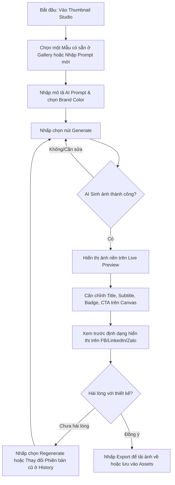

# 🎨 Apex AI — Tài liệu Thiết kế Giao diện Thumbnail Studio

Tài liệu này đặc tả thiết kế giao diện (UI/UX) cho module **Thumbnail Studio** tích hợp vào hệ thống **Apex AI Portal** (AI Marketing SaaS). Thiết kế tuân thủ các nguyên tắc giao diện cao cấp, chuyên nghiệp, hiện đại, tối ưu trải nghiệm người dùng trên thiết bị di động (Responsive) và đồng bộ với hệ thống Design System hiện tại của dự án.

---

## 📐 1. Cấu Trúc Bố Cục Không Gian (Layout Architecture)

Giao diện áp dụng tỷ lệ chia màn hình linh hoạt (Responsive Grid Layout) kết hợp phong cách **Dark Sidebar & Light Content** sang trọng.

### Sơ đồ Bố cục (Layout Wireframe)
```
┌────────────────────────────────────────────────────────────────────────────────────────┐
│  Breadcrumb: Workspace / Thumbnail Studio                                      🔔 User  │
├──────────────────────┬─────────────────────────────────────────┬───────────────────────┤
│                      │ 📝 STUDIO EDITOR                        │ 👁️ LIVE PREVIEW      │
│  📁 TEMPLATE GALLERY │                                         │                       │
│  ┌────────────────┐  │ 🤖 AI Setup & Prompts                   │  ┌─────────────────┐  │
│  │ [Template #1]  │  │ ┌─────────────────────────────────────┐ │  │                 │  │
│  │ [Template #2]  │  │ │ AI Prompt Input                     │ │  │     BADGE       │  │
│  │ [Template #3]  │  │ └─────────────────────────────────────┘ │  │                 │  │
│  └────────────────┘  │ ┌─────────────────────────────────────┐ │  │     TITLE       │  │
│                      │ │ Image Prompt Input                  │ │  │                 │  │
│  ⏱️ HISTORY          │ └─────────────────────────────────────┘ │  │    Subtitle     │  │
│  ┌────────────────┐  │  [⚙️ Generate]     [🔄 Regenerate]     │  │                 │  │
│  │ v2.1 - 10:30   │  │                                         │  │   [  CTA  ]     │  │
│  │ v2.0 - 09:15   │  │ 🎨 Brand & Content Layers               │  │                 │  │
│  │ v1.0 - 08:00   │  │ ┌───────────────┐ ┌───────────────────┐ │  └─────────────────┘  │
│  └────────────────┘  │ │ Brand Color   │ │ Title             │ │   [📥 Export]         │
│                      │ └───────────────┘ └───────────────────┘ │                       │
│                      │ ┌───────────────┐ ┌───────────────────┐ │   🎨 Kênh hiển thị:   │
│                      │ │ Subtitle      │ │ Badge             │ │   (•) FB  ( ) LinkedIn│
│                      │ └───────────────┘ └───────────────────┘ │                       │
│                      │ ┌───────────────┐                       │                       │
│                      │ │ CTA Text      │                       │                       │
│                      │ └───────────────┘                       │                       │
└──────────────────────┴─────────────────────────────────────────┴───────────────────────┘
```

---

## 🗂️ 2. Mô Tả Chi Tiết Các Phân Vùng UI

### A. Dark Sidebar (Thanh điều hướng tối - `#0b0f19`)
*Nằm bên trái màn hình, đóng vai trò như một kho lưu trữ và thư viện.*

1. **Template Gallery (Thư viện Mẫu)**:
   - Các khung hình tỉ lệ chuẩn (16:9 cho YouTube/Facebook, 1:1 cho Instagram/Zalo, 4:5 cho LinkedIn).
   - Hiển thị danh sách card dạng lưới nhỏ (Grid) có bo góc `R.MD` (8px). Khi di chuột qua (Hover), card phóng to nhẹ `scale(1.03)` kèm viền phát sáng màu Primary.
   - Thẻ tag phân loại: `Tech`, `SaaS`, `E-Commerce`, `Business`.
2. **History & Version (Lịch sử Phiên bản)**:
   - Danh sách dòng thời gian (Timeline) lưu các bản thiết kế thumbnail đã tạo.
   - Mỗi mốc lịch sử hiển thị: Mã phiên bản (`v2.1`, `v2.0`), thời gian và thumbnail siêu nhỏ (Avatar Preview).
   - Nút hành động nhanh: Khôi phục phiên bản cũ (Restore), Nhân bản (Clone).

---

### B. Light Content Editor (Phân vùng Biên soạn - Canvas `#f8fafc`, Card `#ffffff`)
*Nằm ở trung tâm, tập trung vào việc tùy chỉnh thông số và ra lệnh cho AI.*

1. **AI Setup (Cấu hình AI)**:
   - **AI Prompt**: Khung văn bản lớn (Text Area) để mô tả mong muốn thiết kế (ví dụ: *"Tạo một thumbnail phong cách Futuristic, có kỹ sư phần mềm đang làm việc với AI"*).
   - **Image Prompt**: Prompt chi tiết đã được AI tối ưu hóa để gửi đến AI Engine (DALL-E/Midjourney). Có thể sửa đổi trực tiếp.
   - **Nút hành động**:
     - `Generate` (Màu Primary - Xanh dương đậm): Bắt đầu quá trình tạo mới. Hiệu ứng loading dạng quay tròn (Spinner) hoặc Skeleton giả lập ảnh đang load.
     - `Regenerate` (Màu Secondary - Viền xám, nền trắng): Tạo lại biến thể khác dựa trên cấu hình hiện tại.
2. **Brand & Content Layers (Lớp nhận diện & Nội dung chữ)**:
   - **Brand Color**: Bộ chọn màu (Color Pickers) đồng bộ tự động từ *Company Brain*:
     - *Primary Color* (Màu chủ đạo)
     - *Secondary Color* (Màu phụ)
     - *Background Overlay* (Lớp phủ nền tối/sáng)
   - **Title & Subtitle**: Trường nhập văn bản tiêu đề lớn hiển thị trên ảnh. Cho phép chỉnh kích cỡ chữ, vị trí (Trái/Giữa/Phải).
   - **Badge**: Nhãn nổi bật (Ví dụ: *"Hot Topic"*, *"New"*). Tự động định dạng chữ in hoa, bo góc nhẹ.
   - **CTA (Call to Action)**: Nút bấm giả lập chèn lên ảnh (Ví dụ: *"Xem Ngay"*, *"Click Here"*).

---

### C. Preview & Action Panel (Light Content / Sticky - `#ffffff`)
*Nằm bên phải, hiển thị thời gian thực kết quả thiết kế giúp marketer căn chỉnh trực quan trước khi xuất bản.*

1. **Live Preview Panel**:
   - Mockup canvas động mô phỏng ảnh thumbnail thực tế.
   - Hiển thị trực quan vị trí lớp nền (Image generated by AI) kết hợp với các lớp văn bản (Title, Subtitle, Badge) và nút bấm (CTA) chồng lên theo phong cách thiết kế SaaS chuyên nghiệp.
   - Bộ chọn bộ lọc hiển thị (Kênh phân phối): Cho phép xem trước thumbnail hiển thị thế nào trên bảng tin Facebook, LinkedIn hay Zalo.
2. **Export (Xuất bản)**:
   - Nút `Export` (Màu Success - Xanh lá cây) nổi bật.
   - Menu tùy chọn định dạng xuất file: `PNG (High Quality)`, `JPEG (Optimized for Web)`.
   - Lựa chọn tích hợp: **"Lưu trực tiếp vào Thư viện tài sản (Assets Library)"** để đăng bài lập lịch.

---

## 🎨 3. Hệ Thống Màu Sắc & Kiểu Chữ (Design Tokens)

Đồng bộ với Apex AI Design System nhằm đảm bảo tính chuyên nghiệp của sản phẩm Marketing SaaS:

| Token | Giá trị CSS / Thuộc tính | Mô tả |
| :--- | :--- | :--- |
| **Dark Sidebar Bg** | `#0b0f19` | Nền tối sâu cho cảm giác SaaS chuyên nghiệp |
| **Light Content Bg** | `#f8fafc` | Nền sáng trung tính cho khu vực làm việc |
| **Primary Color** | `#2563eb` (Blue 600) | Nút hành động chính (Generate) |
| **Success Color** | `#16a34a` (Green 600) | Nút xuất bản và thành công (Export) |
| **Border Radius** | `12px` (`R.LG`) | Góc bo cho các thẻ cấu hình và Preview |
| **Typography** | `Inter`, `system-ui` | Phông chữ hiện đại, rõ ràng, dễ đọc trên màn hình |
| **Shadow** | `0 4px 20px -2px rgba(0,0,0,0.05)` | Shadow mượt tạo độ nổi khối cho các Card |

---

## 📱 4. Thiết Kế Đáp Ứng (Responsive Matrix)

Giao diện tự động co giãn theo kích thước màn hình thiết bị:

1. **Màn hình máy tính (Desktop - $\ge$ 1200px)**:
   - Hiển thị đầy đủ 3 cột: Sidebar (trái) | Editor (giữa) | Preview (phải).
2. **Màn hình máy tính bảng (Tablet - 768px - 1199px)**:
   - Sidebar thu hẹp thành thanh biểu tượng (Icon-only Sidebar) hoặc tự ẩn.
   - Editor và Preview chia đôi không gian màn hình trái - phải.
3. **Màn hình điện thoại (Mobile - < 768px)**:
   - Chuyển thành bố cục 1 cột dọc (Single Column layout).
   - Sidebar ẩn đi, truy cập qua Menu Hamburger góc trên bên trái.
   - Khối **Live Preview** được ưu tiên đẩy lên đầu trang (hoặc ghim nổi phía dưới dạng mini-preview) để người dùng thấy ngay thay đổi khi chỉnh sửa biểu mẫu Editor bên dưới.

---

## 🔄 5. Luồng Tương Tác Của Người Dùng (User Interaction Flow)


