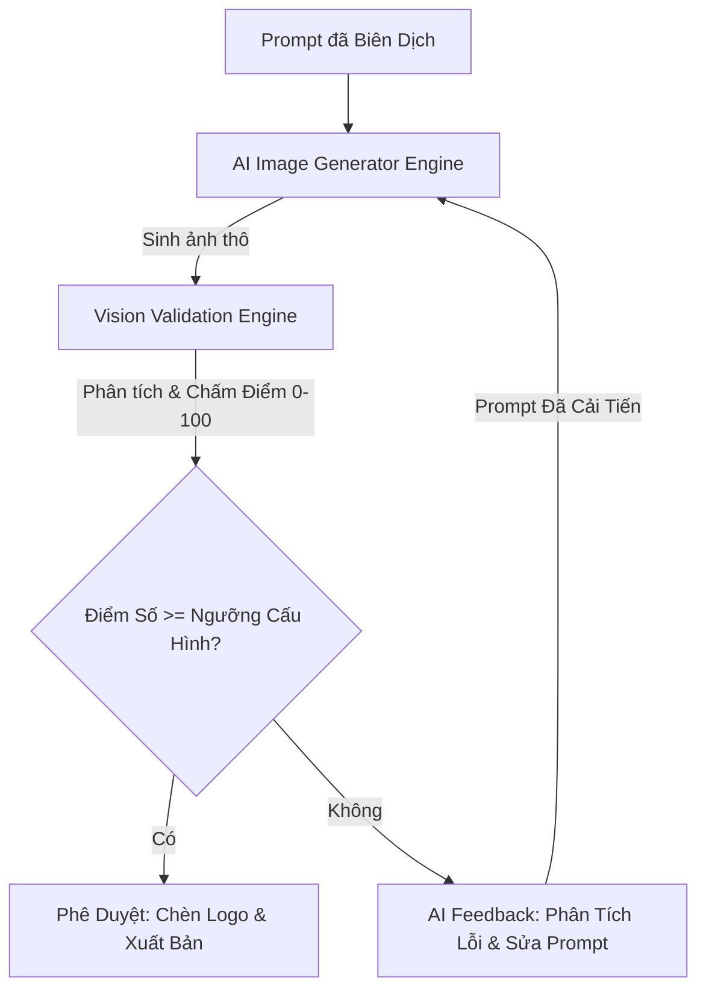

# Thiết Kế Hệ Thống Đánh Giá & Kiểm Định Hình Ảnh Tự Động (Vision Validation Engine)

**Vision Validation Engine** là chốt chặn kiểm soát chất lượng cuối cùng trong quy trình sinh ảnh của AI Marketing Platform. Hệ thống sử dụng các mô hình thị giác máy tính tiên tiến (Multimodal LLMs như GPT-4o / Gemini 1.5 Pro / Claude 3.5 Sonnet kết hợp cùng các mô hình phân tích phân đoạn cảnh quan - Scene Segmentation) để tự động thẩm định, chấm điểm ảnh và ra quyết định sinh lại (Regenerate) nếu hình ảnh đầu ra không đạt chuẩn yêu cầu.

---

## 1. Kiến Trúc Quy Trình Kiểm Định & Tự Sửa Sai (Loop Workflow)

Hệ thống hoạt động theo mô hình vòng lặp phản hồi khép kín (Feedback Loop) để đảm bảo chất lượng đầu ra:



---

## 2. 10 Tiêu Chí Thẩm Định Chất Lượng Thị Giác (10 Validation Pillars)

Hệ thống chấm điểm hình ảnh dựa trên 10 tiêu chí đánh giá nghiêm ngặt, mỗi tiêu chí được gán trọng số linh hoạt tùy thuộc vào mục tiêu chiến dịch quảng cáo:

1. **Đúng chủ đề (Topic Alignment)**: Xác minh các vật thể, thực thể xuất hiện trong ảnh có khớp với chủ đề được yêu cầu hay không.
2. **Đúng thông điệp (Message Fit)**: Đánh giá xem hình ảnh có truyền tải được ẩn ý hoặc nội dung cốt lõi của bài viết hay không.
3. **Đúng nhân vật (Character Accuracy)**: Nếu yêu cầu có con người (giới tính, độ tuổi, trang phục, sắc tộc), hệ thống kiểm tra tính nhất quán và tự nhiên (tránh lỗi biến dạng khuôn mặt hoặc tay chân thừa ngón).
4. **Đúng thương hiệu (Brand Guidelines Consistency)**: Đánh giá độ tương hợp tổng thể với phong cách nghệ thuật thương hiệu (Illustration/Photography Style).
5. **Đúng màu (Color Match Score)**: Đo lường khoảng cách màu (Color Distance/Color Histogram comparison) giữa bức ảnh và bảng màu thương hiệu (Primary, Secondary Colors).
6. **Đúng cảm xúc (Emotion Resonance)**: Phân tích biểu cảm khuôn mặt của nhân vật và sắc thái ánh sáng của ảnh để đảm bảo trùng khớp với cảm xúc thương hiệu yêu cầu (ví dụ: Vui vẻ, Yên tâm, Sang trọng).
7. **Đúng đối tượng (Target Audience Fit)**: Đánh giá xem phong cách hình ảnh có cuốn hút đối tượng khách hàng mục tiêu hay không (ví dụ: thế hệ trẻ GenZ chuộng màu rực rỡ, năng động; tệp khách hàng doanh nghiệp B2B chuộng sự tối giản, chuyên nghiệp).
8. **Đúng ngành nghề (Industry Appropriateness)**: Đảm bảo bối cảnh ảnh phù hợp với ngành (ví dụ: Ngành Y tế phải có môi trường sạch sẽ, màu xanh/trắng; ngành Công nghệ phải có tông màu hiện đại, tối giản).
9. **Đúng bố cục (Composition Rule Check)**: Phân tích vị trí của chủ thể chính xem có nằm đúng các điểm neo của lưới 1/3 (Rule of Thirds) hay không.
10. **Đúng CTA Area (CTA Overlay Compatibility)**: Quét vùng được định cấu hình làm CTA hoặc Headline để đảm bảo vùng này thực sự là "vùng trống ít chi tiết" (Negative Space) để chữ đè lên không bị rối mắt.

---

## 3. Cấu Trúc Trả Về Của Hệ Thống Thẩm Định (Validation Output Schema)

Sau khi phân tích ảnh thô, Vision Validation Engine trả về kết quả dưới dạng JSON đánh giá chi tiết:

```json
{
  "validation_result": {
    "image_id": "img_987654_raw",
    "overall_score": 68,
    "pass_threshold": 80,
    "status": "REJECTED",
    "metrics": {
      "topic_alignment": { "score": 90, "feedback": "Chủ thể lập trình viên chính xác." },
      "message_fit": { "score": 85, "feedback": "Đạt yêu cầu thông điệp công nghệ." },
      "character_accuracy": { "score": 95, "feedback": "Nhân vật vẽ tự nhiên, không lỗi giải phẫu." },
      "brand_consistency": { "score": 70, "feedback": "Phong cách ảnh hơi rực so với tối giản thương hiệu." },
      "color_match": { "score": 50, "feedback": "Lạm dụng màu đỏ chói, lệch khỏi tông xanh lục chủ đạo của EcoSmart." },
      "emotion_resonance": { "score": 80, "feedback": "Cảm xúc chuyên nghiệp đạt yêu cầu." },
      "target_audience_fit": { "score": 75, "feedback": "Tạm chấp nhận cho tệp khách hàng công sở." },
      "industry_appropriateness": { "score": 90, "feedback": "Bối cảnh văn phòng hiện đại phù hợp." },
      "composition_rule": { "score": 45, "feedback": "Chủ thể đứng chính giữa khung hình thay vì lệch trái như yêu cầu bố cục." },
      "cta_compatibility": { "score": 40, "feedback": "Phía bên phải có quá nhiều chi tiết trang trí, không đủ không gian trống để chèn text rõ ràng." }
    },
    "failure_reasons": [
      "Màu sắc lệch khỏi bảng màu thương hiệu.",
      "Chủ thể sai lệch vị trí bố cục.",
      "Vùng CTA quá nhiễu chi tiết để chèn văn bản."
    ]
  }
}
```

---

## 4. Cơ Chế Tự Động Tạo Lại Prompt & Sinh Ảnh (Self-Correction Loop)

Khi trạng thái trả về là `REJECTED` (Điểm số tổng thể nhỏ hơn ngưỡng cấu hình tối thiểu, ví dụ: 80 điểm):

1. **Bước 1: Trích xuất phản hồi lỗi (Error Analysis)**: Hệ thống tổng hợp các lý do thất bại (`failure_reasons`) và các phản hồi lỗi từ các tiêu chí có điểm số dưới 70.
2. **Bước 2: Nạp vào Prompt Generator Agent**: Hệ thống gửi Prompt cũ kèm theo danh sách lỗi thiết kế đã được phân tích của ảnh vừa sinh cho LLM.
3. **Bước 3: Tinh chỉnh Prompt (Prompt Refinement)**: LLM tự động bổ sung các chỉ dẫn cụ thể hơn (Negative Prompt hoặc cấu trúc lại vị trí vật thể) để khắc phục lỗi.
   - *Ví dụ sửa đổi*: Bổ sung: `"--no red colors, make the right side of the image completely empty with a flat white wall background, place the main character strictly on the left third of the image"`.
4. **Bước 4: Thực thi sinh ảnh lại**: Hệ thống gửi Prompt đã sửa đổi tới AI Image Generator để tạo ra phiên bản ảnh mới tốt hơn.

---
*Tài liệu này định hình kiến trúc xử lý chất lượng ảnh đầu ra, ngăn chặn tình trạng ảnh AI bị lỗi hiển thị hoặc lệch chuẩn thương hiệu trước khi tiếp cận người dùng.*
