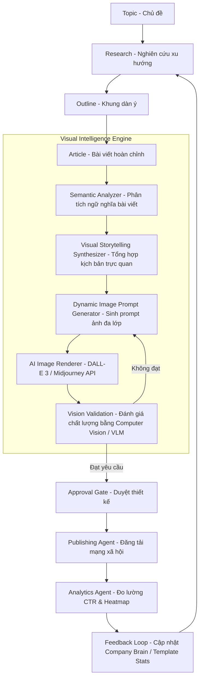

# 🧠 Visual Intelligence Engine Architecture

Tài liệu này đặc tả thiết kế kiến trúc cho **Visual Intelligence Engine (VIE)** — thế hệ tiếp theo của bộ máy thiết kế Thumbnail và tài nguyên trực quan cho hệ thống Apex AI.

Thay vì tạo Thumbnail dựa trên từ khóa đơn lẻ hoặc tiêu đề thô, VIE hoạt động như một hệ thống nhận thức đa phương tiện giúp chuyển dịch một bài viết hoàn chỉnh (Article) thành một **Visual Story** có tính logic cao, kết hợp kiểm định thị giác nâng cao (Vision Validation) nhằm bảo đảm chất lượng đầu ra.

---

## 📐 1. Luồng Quy Trình Hoạt Động (End-to-End Workflow)

### Chi tiết các bước trong quy trình:
1. **Topic (Chủ đề)**: Điểm xuất phát của chiến dịch.
2. **Research (Nghiên cứu)**: Thu thập thông tin, xu hướng từ *Trend Service* hoặc công cụ Research.
3. **Outline (Dàn ý)**: Lập khung bố cục bài viết.
4. **Article (Bài viết)**: Nội dung chi tiết được sinh bởi *AI Content Generator*.
5. **Visual Intelligence Engine (VIE)**:
   - **Semantic Analyzer**: Trích xuất những thực thể cốt lõi, khái niệm trừu tượng và các điểm nhấn logic trong bài viết.
   - **Visual Storytelling Synthesizer**: Dịch nội dung bài viết sang một kịch bản trực quan có cốt truyện (Visual Story) giàu hình ảnh, cảm xúc.
   - **Dynamic Image Prompt Generator**: Khớp các tham số thiết kế để xuất ra prompt chi tiết kèm safe-zone và các quy chuẩn thẩm mỹ.
   - **AI Image Renderer**: Sinh ảnh từ API mô hình khuếch tán.
   - **Vision Validation**: Kiểm định chất lượng ảnh bằng công cụ Computer Vision và Vision Language Model (VLM).
6. **Approval (Phê duyệt)**: Gửi qua quy trình duyệt đa cấp (Editor / Manager / CEO).
7. **Publishing (Đăng bài)**: Gửi ảnh kèm nội dung đã định dạng theo spec lên các mạng xã hội.
8. **Analytics**: Đo lường CTR thực tế và heatmap để phục vụ việc tối ưu hóa tự động.

---

## 🏗️ 2. Các Module Mới Của Visual Intelligence Engine (VIE)

### 2.1. Semantic & Visual Story Analyzer (Bộ Phân Tích Ngữ Nghĩa & Kịch Bản Trực Quan)
- **Chức năng**: Nhận đầu vào là toàn bộ văn bản của bài viết (`content` từ `posts`). Không chỉ đọc tiêu đề, module này sẽ phân tích các luận điểm chính, so sánh, số liệu thống kê hoặc case study nổi bật trong bài viết.
- **Visual Metaphor (Ẩn dụ thị giác)**: Chuyển các khái niệm trừu tượng (ví dụ: "tiết kiệm chi phí", "tăng tốc độ xử lý") thành các ẩn dụ hình ảnh dễ hiểu (ví dụ: "đồng hồ cát cát chảy ngược thành tiền vàng", "siêu xe phóng trên tia sáng mạch điện tử").

### 2.2. Multimodal Vision Validation Engine (VLM Verification Layer)
- **Chức năng**: Sử dụng các mô hình ngôn ngữ lớn đa phương thức (như Gemini 2.5 Flash Vision / Gemini 2.5 Pro) để "nhìn" bức ảnh được tạo ra từ AI Image Renderer và thực hiện đánh giá độc lập.
- **Checklist kiểm định thị giác (Vision Validation Checklist)**:
  - **Mức độ tương thích bài viết (Relevance)**: Ảnh có khớp với thông điệp cốt lõi của bài viết hay không?
  - **Nhận diện thương hiệu (Brand Consistency)**: Màu sắc có đúng tone thương hiệu? Vùng logo có bị đè chữ?
  - **Chất lượng đồ họa (Aesthetic Quality)**: Kiểm tra lỗi biến dạng nhân vật (méo mặt, thiếu/thừa ngón tay), độ mờ (blurry), độ tương phản của Text Overlay.
  - **Khả năng đọc (Readability)**: Kiểm tra xem văn bản chồng lên ảnh (Text Overlay) có bị chìm vào nền hay không bằng cách tính độ tương phản Luminance giữa text và background vùng đó.

### 2.3. Dynamic Layout & Overlay Compositor (Pillow Layer)
- **Chức năng**: Ghép nối tự động các dải màu, gradient overlay, watermark thương hiệu, logo PNG và Text Overlay (Title, Subtitle, Badge) lên trên ảnh do AI sinh ra dựa theo tham số tọa độ được VIE quy định.

---

## 🔗 3. Các Mối Quan Hệ Tích Hợp Hệ Thống

### 3.1. Quan hệ với AI Content Generator (`services/content_service.py`)
- VIE đóng vai trò là một dịch vụ hạ nguồn (downstream service) của Content Generator. Khi Content Generator hoàn thành việc soạn thảo bài viết, nó sẽ gửi toàn bộ cấu trúc bài viết (gồm tiêu đề, nội dung chi tiết, các ý chính) sang VIE.
- Content Generator có thể đính kèm nhãn `visual_anchor` trong văn bản để chỉ định cho VIE biết phần nào trong bài viết cần được lấy làm chủ thể hình ảnh chính.

### 3.2. Quan hệ với Brand Voice & Company Brain (`ui/tab_brand.py`)
- VIE lấy trực tiếp các thông số nhận diện của Brand từ Database:
  - **Brand Voice/Tone**: Chuyển đổi giọng điệu chữ viết (ví dụ: "Bold") thành phong cách hình ảnh tương ứng (ví dụ: "High-contrast dynamic camera angles").
  - **Blacklist Words**: Ngăn chặn tuyệt đối việc sử dụng các từ ngữ cấm xuất hiện trên Text Overlay của Thumbnail.
  - **Company Brain (Product/Target Customer)**: Đảm bảo hình ảnh nhân vật do AI vẽ ra khớp với nhân khẩu học của khách hàng mục tiêu (ví dụ: CEO trong phòng làm việc cao cấp vs Chủ cửa hàng tạp hóa bình dân).

### 3.3. Quan hệ với Publishing (`ui/tab_publishing.py`)
- VIE kiểm tra kích thước ảnh tự động dựa trên nền tảng đăng ký (Facebook, LinkedIn, Zalo OA).
- Thiết lập các vùng Safe Zone động nhằm tránh việc UI của các nền tảng xã hội che mất nội dung chữ hoặc logo thương hiệu trên ảnh.

### 3.4. Quan hệ với Analytics (`ui/tab_thumbnail_analytics.py`)
- Thu thập dữ liệu phản hồi (Feedback Loop): Sau khi bài viết được đăng, dữ liệu CTR và lượng clicks sẽ được ghi nhận.
- VIE phân tích xem phong cách nghệ thuật nào (ví dụ: 3D render vs Editorial Photography) mang lại hiệu quả chuyển đổi cao nhất cho phân khúc khách hàng đó, từ đó điều chỉnh trọng số tự động cho các lần sinh prompt tiếp theo.

### 3.5. Quan hệ với Media Library (`database/models/assets.py`)
- Mọi biến thể hình ảnh và cấu hình JSON của VIE được lưu trữ dưới dạng các phiên bản (Versioning) trong bảng `assets` bằng cột `tags` (JSON).
- Người dùng có thể dễ dàng duyệt lại lịch sử, khôi phục hoặc nhân bản các visual assets cũ.

---

*Tài liệu kiến trúc VIE được phát triển bởi Principal AI Architect. Cập nhật lần cuối: 2026-07-12.*
