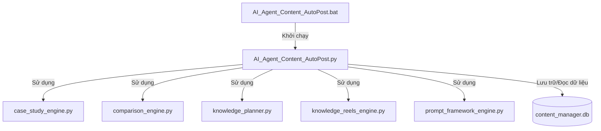

# BIỂU ĐỒ PHỤ THUỘC (DEPENDENCY_GRAPH.md)

Tài liệu này thể hiện mối quan hệ phụ thuộc giữa các module nội bộ của dự án cũng như với các thư viện và dịch vụ bên thứ ba.

---

## 1. Mối Quan Hệ Giữa Các Module Nội Bộ

Dưới đây là sơ đồ tương tác và phụ thuộc giữa các file code nguồn của hệ thống:



*Giải thích*:
*   **`AI_Agent_Content_AutoPost.py`** đóng vai trò là "điểm hội tụ" trung tâm điều khiển (Orchestrator). Toàn bộ luồng nghiệp vụ trên UI đều trực tiếp import và gọi hàm từ các file engine chuyên biệt.
*   **`case_study_engine.py`**, **`comparison_engine.py`**, **`knowledge_planner.py`**, **`knowledge_reels_engine.py`**, **`prompt_framework_engine.py`** là các thư viện tiện ích cục bộ (Utility/Helper Modules), không phụ thuộc ngược lại vào file giao diện.

---

## 2. Danh Sách Thư Viện Bên Thứ Ba (External Dependencies)

Các thư viện chính được sử dụng trong mã nguồn và mục đích của chúng:

| Tên thư viện | Phạm vi sử dụng | Mục đích chính |
| :--- | :--- | :--- |
| `streamlit` | `AI_Agent_Content_AutoPost.py` | Tạo giao diện Web ứng dụng và quản lý Session State. |
| `google-generativeai` | `AI_Agent_Content_AutoPost.py` | Kết nối và thực thi các câu lệnh Prompt trên mô hình Gemini. |
| `pandas` | `AI_Agent_Content_AutoPost.py` | Đọc dữ liệu SQL và hiển thị lên bảng dữ liệu Streamlit. |
| `sqlite3` | `AI_Agent_Content_AutoPost.py` | Tương tác với cơ sở dữ liệu local SQLite. |
| `python-docx` | `AI_Agent_Content_AutoPost.py` | Tạo và ghi dữ liệu ra định dạng tài liệu Microsoft Word (.docx). |
| `fpdf` | `AI_Agent_Content_AutoPost.py` | Tạo và định dạng dữ liệu ra file PDF (.pdf). |
| `requests` | `AI_Agent_Content_AutoPost.py` | Thực hiện các yêu cầu HTTP POST để đẩy bài viết lên các mạng xã hội. |
| `python-dotenv` | `AI_Agent_Content_AutoPost.py` | Tải các biến môi trường cấu hình (như API keys) từ file `.env`. |

---

## 3. Tương Tác Với Các API Ngoại Vi (External Services Dependency)

Hệ thống phụ thuộc chặt chẽ vào các API sau để hoạt động bình thường:

```
[Ứng dụng AI-Agent]
        │
        ├──► Google Gemini API (Sinh nội dung, kiểm tra lỗi cú pháp JSON)
        │
        ├──► Facebook Graph API (Publish nội dung lên Fanpage)
        │
        ├──► Zalo OA OpenAPI (Gửi tin nhắn truyền thông - Broadcast)
        │
        └──► LinkedIn API (Đăng tải nội dung UGC Posts)
```
