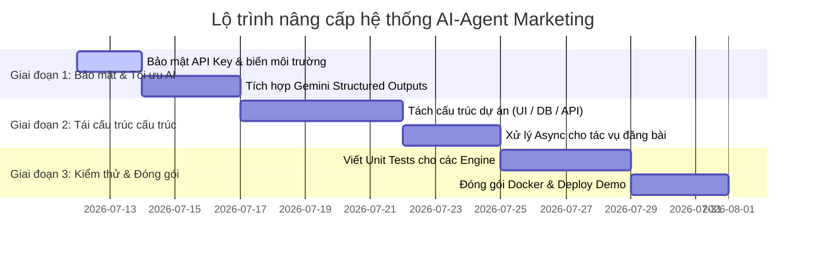

# KẾ HOẠCH NÂNG CẤP TỔNG THỂ (MASTER_UPGRADE_PLAN.md)

Tài liệu này vạch ra lộ trình (Roadmap) nâng cấp, tái cấu trúc mã nguồn và tối ưu hóa dự án **AI-Agent Marketing** lên một tầm cao mới về hiệu năng, bảo mật và khả năng bảo trì.

---

## 1. Mục Tiêu Nâng Cấp
1.  **Bảo mật hóa**: Loại bỏ hoàn toàn API Key cứng, chuyển sang cấu hình biến môi trường an toàn.
2.  **Tái cấu trúc (Refactoring)**: Tách file mã nguồn nguyên khối `AI_Agent_Content_AutoPost.py` thành cấu trúc thư mục dạng Module có tổ chức rõ ràng (tách biệt giao diện UI, kết nối DB, API và Utilities).
3.  **Tối ưu hóa trải nghiệm AI**: Áp dụng cơ chế **Structured Outputs** của Gemini API để đảm bảo định dạng JSON trả về chuẩn 100%, thay thế cho logic sửa chữa JSON thô sơ hiện tại.
4.  **Bất đồng bộ hóa (Asynchrony)**: Triển khai các tác vụ gọi API mạng xã hội chạy ngầm bằng Threading hoặc Task Queue để tránh làm treo giao diện người dùng Streamlit.
5.  **Chuẩn hóa Quy trình Phát triển**: Bổ sung Unit Tests cho các Engine cốt lõi (`case_study_engine`, `comparison_engine`, v.v.).

---

## 2. Lộ Trình Triển Khai (Roadmap)

Kế hoạch nâng cấp được chia làm 3 giai đoạn:

### Giai đoạn 1: Bảo mật thông tin & Tối ưu hóa phản hồi AI (Dự kiến: 5 ngày)
*   **Bước 1**: Tạo file mẫu `.env.example` và chuyển toàn bộ API Key của Gemini, Access Token của Facebook/Zalo/LinkedIn sang file cấu hình `.env` cục bộ. Chỉnh sửa file `.bat` để chỉ đọc cấu hình từ môi trường.
*   **Bước 2**: Thay đổi thư viện gọi Gemini API để truyền `response_schema` dạng Pydantic Model. Điều này triệt tiêu hoàn toàn khả năng lỗi JSON của Gemini khi lập kế hoạch tuần.

### Giai đoạn 2: Tái cấu trúc kiến trúc mã nguồn (Dự kiến: 8 ngày)
*   **Bước 1**: Di chuyển các hàm tương tác SQLite ra file `src/database/db_manager.py`.
*   **Bước 2**: Di chuyển các hàm gọi API (Gemini, Facebook, Zalo, LinkedIn) ra `src/services/api_clients.py`.
*   **Bước 3**: Di chuyển các hàm xuất định dạng Word/PDF ra `src/utils/document_exporter.py`.
*   **Bước 4**: Tối ưu hóa file `AI_Agent_Content_AutoPost.py` chỉ còn làm nhiệm vụ render giao diện và gọi các service xử lý.
*   **Bước 5**: Áp dụng thư viện `threading` hoặc hàng đợi tác vụ nhẹ để gửi tin nhắn mạng xã hội ngầm dưới nền background.

### Giai đoạn 3: Kiểm thử chất lượng & Triển khai (Dự kiến: 7 ngày)
*   **Bước 1**: Thiết lập khung kiểm thử `pytest`. Viết các bài kiểm tra (Unit Tests) cho 5 file engine cục bộ để đảm bảo thuật toán sinh mã Markdown không bị lỗi logic.
*   **Bước 2**: Xây dựng file cấu hình Docker (`Dockerfile` và `docker-compose.yml`) để đóng gói ứng dụng Streamlit và cơ sở dữ liệu SQLite chạy độc lập trên mọi môi trường máy chủ.
