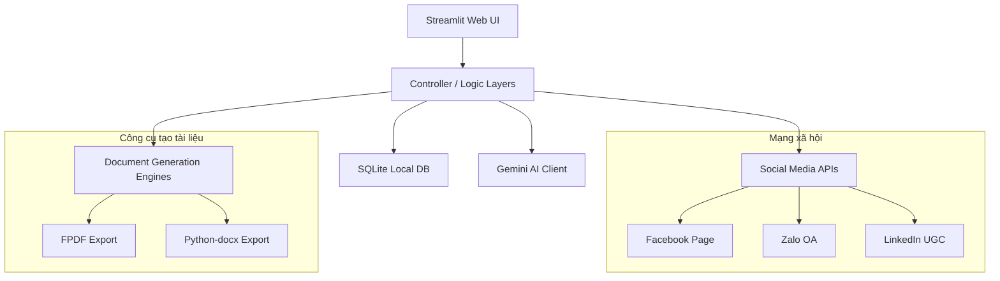

# KIẾN TRÚC DỰ ÁN (PROJECT_ARCHITECTURE.md)

Tài liệu này mô tả chi tiết kiến trúc hiện tại của dự án **AI-Agent Marketing (AI_Agent_Content_AutoPost)**.

---

## 1. Tổng Quan Kiến Trúc
Dự án được xây dựng theo kiến trúc **Monolithic App** dựa trên khung giao diện của **Streamlit**. 
*   **Frontend**: Streamlit Components (HTML/CSS tùy biến giao diện qua `st.markdown`).
*   **Backend & Business Logic**: Các file python phục vụ chức năng tạo lịch trình, so sánh công cụ AI, sinh kịch bản video và tạo bài học Case Study.
*   **Database**: SQLite (`content_manager.db`) chạy local, thực hiện các truy vấn đồng bộ (synchronous).
*   **External Integration (API)**: Tích hợp trực tiếp các API bên thứ ba gồm Google Gemini, Facebook Graph, Zalo OA và LinkedIn.

---

## 2. Các Thành Phần Kiến Trúc Chính

### 2.1. Lớp Trình Diễn (Presentation Layer)
*   Nằm toàn bộ trong `AI_Agent_Content_AutoPost.py` sử dụng Streamlit.
*   Giao diện gồm Sidebar (cấu hình khóa API và Access Token) và 3 Tab làm việc chính:
    *   **Tab Lên lịch tuần (`tab_plan`)**: Hiển thị bảng kế hoạch và nút tải Word.
    *   **Tab Tạo & Đăng Bài (`tab_create`)**: Form nhập liệu cấu hình chủ đề bài viết và các thiết lập nâng cao.
    *   **Tab Lịch sử bài viết (`tab_history`)**: Quản lý lịch sử bài đăng, chọn dòng để tải PDF/DOCX/CSV.

### 2.2. Lớp Dịch Vụ & Xử Lý Core (Business & Logic Layer)
*   **Weekly Content Planner**: Lên kế hoạch phân bổ nội dung.
*   **Knowledge Reels Creator**: Thiết lập kịch bản video ngắn cho Reels/TikTok.
*   **Prompt Framework Builder**: Tổ chức prompt theo định dạng có sẵn.
*   **Case Study & Comparison Generators**: Các logic phụ trợ phân tích đối thủ và ví dụ thực tế.

### 2.3. Lớp Dữ Liệu (Data Access Layer)
*   Sử dụng SQLite với cơ chế kết nối qua hàm `get_db_connection()`.
*   Bảng dữ liệu:
    *   `posts`: Lưu thông tin ngày đăng, nền tảng, chủ đề, nội dung bài viết và trạng thái.
    *   `weekly_schedules`: Lưu kế hoạch theo tuần dạng JSON (`plan_json`).
    *   `knowledge_posts`: Lưu bài chia sẻ kiến thức với siêu dữ liệu (đối tượng, độ khó, công cụ...).

### 2.4. Lớp Tích Hợp Ngoại Vi (External Integration Layer)
*   **Google Gemini Client**: Gọi API tạo nội dung dựa trên Prompt kỹ thuật. Có thêm cơ chế tự sửa (repair) JSON nếu AI trả về sai định dạng.
*   **Social API Clients**:
    *   Facebook: Gửi POST request tới `/feed` với Access Token.
    *   Zalo OA: Gửi POST request tới `/oa/message` (tin nhắn Broadcast).
    *   LinkedIn: Gửi POST request tới `/ugcPosts` dạng PUBLISHED.

---

## 3. Luồng Dữ Liệu Điển Hình (Data Flow)

### 3.1. Luồng Lập Kế Hoạch Tuần (Weekly Plan)
1. Người dùng gửi yêu cầu thông qua Form tại **Tab Lên lịch tuần**.
2. Ứng dụng gọi `get_weekly_plan()` gửi Prompt tới Gemini.
3. Gemini phản hồi kết quả dạng JSON.
4. Logic trong `parse_weekly_plan_json()` xác thực cấu trúc JSON. Nếu lỗi, gọi Gemini sửa lỗi (Repair Workflow).
5. Lưu kết quả vào bảng `weekly_schedules` và hiển thị trên màn hình Streamlit.
6. Cho phép xuất sang Word (`python-docx`).

### 3.2. Luồng Tạo & Đăng Bài (Content Generation & Auto-Post)
1. Người dùng chọn nền tảng, loại nội dung, góc nhìn, đối tượng mục tiêu.
2. Hệ thống gọi Prompt chuyên biệt dựa trên lựa chọn đối tượng và góc nhìn.
3. Nếu nội dung thuộc loại `AI Knowledge Sharing`, gọi `generate_ai_knowledge_content()` với các cấu trúc chuẩn hóa.
4. Trích xuất văn bản đầu ra và các Prompt ảnh minh họa đi kèm.
5. Nếu bật `auto_post`, gọi các hàm tích hợp mạng xã hội để đăng tải.
6. Ghi chép lịch sử vào bảng dữ liệu tương ứng trong SQLite.
