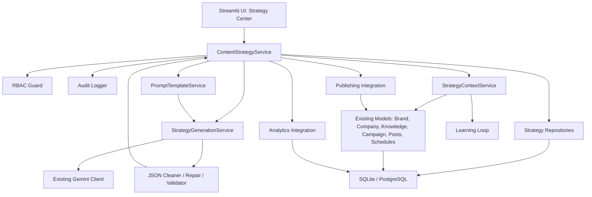
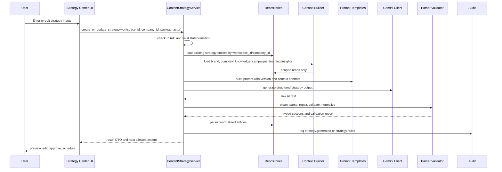
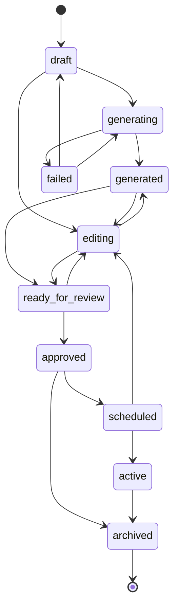

# AI Content Strategy Center Architecture

Pham vi tai lieu nay la thiet ke kien truc chi tiet cho viec nang cap `Content Planning Wizard` thanh `AI Content Strategy Center`. Khong trien khai UI, khong tao migration, khong thay doi schema trong task nay.

## 1. System Context

Ung dung hien tai la Streamlit monolith co routing tai `app/main.py`. Content Planning Wizard nam o `ui/tab_content_planning_wizard.py`, duoc render voi `gemini_key`, `workspace_id`, va `role`. Weekly flow hien tai da co duong UI -> service -> Gemini JSON parser qua `services/content_service.py:create_weekly_plan()` va `services/gemini_client.py:generate_weekly_plan_json()`. Tuy nhien mot so nhanh trong wizard van goi `generate_with_gemini()` va `PostModel.create()` truc tiep tu UI.

AI Content Strategy Center se mo rong wizard hien co, khong viet lai ung dung. Module phai ho tro chuoi du lieu:

```text
Business Context
-> Brand Identity
-> Audience Personas
-> Business Goals
-> Content Pillars
-> Subtopics
-> Content Angles
-> Content Formats
-> Content Calendar
-> Campaign
-> Publishing
-> Analytics
-> Learning Loop
```

Nguon tai su dung bat buoc:

- Gemini client hien tai: `services/gemini_client.py`.
- JSON cleaning va repair hien tai: `clean_ai_json_text()`, `generate_weekly_plan_json()`; se tach/cung co thanh parser/validator chung sau nay.
- Brand Identity: `database.models.brand.BrandModel`.
- Company/Business context: `database.models.companies.CompanyModel`.
- Knowledge Center/RAG: `database.models.knowledge`, `database.repositories.knowledge_repository`, `services.vector_service`.
- Campaigns, posts, schedules: `CampaignModel`, `PostModel`/`PostRepository`, `ScheduleModel`.
- Analytics va Learning Loop: `AnalyticsModel`, `LearningInsightModel`, `workflow.learning_engine`.
- Audit/RBAC: `core.audit_logger`, `database.repositories.audit_repository`, `core.rbac`.

## 2. Target Architecture

Target van la mot Streamlit monolith co layer ro, khong tach microservice.

```text
UI layer
  -> Application/service layer
    -> Context builders
    -> AI generation layer
    -> Prompt template layer
    -> Validation/parser layer
    -> Repository layer
      -> Database layer
    -> Analytics integration
    -> Publishing integration
    -> Audit and RBAC integration
```

Nguyen tac:

- UI chi presentation, form input, preview, user interaction, va hien loi than thien.
- Service layer quyet dinh workflow, state transition, permission, context loading, prompt orchestration, va transaction boundary.
- Repository layer la cua vao database bat buoc cho strategy data va nen duoc dung cho posts/campaign/schedules khi refactor.
- Moi doc/ghi phai co `workspace_id`; neu entity co company context thi phai co `company_id` hoac validate company thuoc workspace.
- SQLite va PostgreSQL cung hoat dong qua `_adapt_sql()`, `managed_connection()`, va JSON serializer/deserializer thong nhat.
- Khong luu toan bo strategy thanh mot JSON blob duy nhat. Chi dung JSON cho metadata linh hoat nhu AI trace, source citations, generation settings, validation warnings.

## 3. Component Diagram



## 4. Data Flow



## 5. Wizard Flow

Target wizard la flow nhieu buoc, co the giu shell 3 buoc hien tai trong giai doan dau:

1. Setup Context: chon workspace/company, nap Business Context, Brand Identity, Knowledge Center, campaign optional.
2. Strategy Inputs: audience personas, business goals, time range, platforms, constraints.
3. AI Generate: sinh pillars, subtopics, angles, formats, calendar proposal.
4. Review/Edit: user sua tung entity typed, khong sua raw JSON blob.
5. Approval: chuyen `ready_for_review` -> `approved` theo RBAC.
6. Schedule: tao posts/schedules tu calendar items, link campaign neu co.
7. Publishing: schedule/publish qua publishing service hien co.
8. Analytics/Learning: dong bo analytics, tao learning_insights, dua insight vao lan generate tiep theo.

UI state chi nen luu temporary form/session keys theo `workspace_id` va `strategy_id`. Persistent state nam trong DB qua repository.

## 6. Service Responsibilities

De xuat them `services/content_strategy_service.py` va cac helper service nho:

- `ContentStrategyService`: facade chinh cho UI; tao/sua strategy, generate, approve, schedule, archive, rollback state.
- `StrategyContextService`: nap company, brand, knowledge snippets, campaign context, analytics summary, learning insights; cat token va redact sensitive values.
- `StrategyGenerationService`: dieu phoi prompt -> Gemini -> parser/validator -> normalized DTO; khong tu ghi DB neu service cha can transaction.
- `StrategyPlanningService`: chuyen pillars/subtopics/angles/formats thanh calendar items va draft post specs.
- `StrategyPublishingService`: tao `posts` va `schedules`, khong goi social API truc tiep tu UI.
- `StrategyAnalyticsService`: map `analytics` theo post/campaign/calendar item, tinh performance theo pillar/angle/format.
- `StrategyStateMachineService`: validate state transition va role.
- `StrategyAuditService`: wrapper quanh `log_action()` voi action names moi.

Tat ca method public phai nhan `workspace_id`; method co company context phai nhan `company_id` hoac resolve company theo workspace trong service.

## 7. Repository Responsibilities

De xuat repository moi khi den task migration:

- `StrategyRepository`: CRUD strategy root, scoped by `workspace_id` va `company_id`.
- `StrategyPersonaRepository`: audience personas.
- `StrategyGoalRepository`: business goals.
- `StrategyPillarRepository`: content pillars.
- `StrategySubtopicRepository`: subtopics linked to pillar.
- `StrategyAngleRepository`: content angles linked to subtopic/pillar.
- `StrategyFormatRepository`: content format rules and platform fit.
- `StrategyCalendarRepository`: calendar items linked to angle/format/campaign/post/schedule.
- `StrategyGenerationRunRepository`: prompt version, model, status, token/cost metadata, validation summary, error category.

Repository rule:

- Khong method nao duoc query strategy data neu thieu `workspace_id`.
- `get_by_id()` phai verify `workspace_id` va, khi co, `company_id`.
- JSON fields chi dung cho `metadata`, `ai_metadata`, `source_refs`, `validation_warnings`, `generation_settings`.
- SQLite dung TEXT JSON; PostgreSQL co the dung JSONB, nhung repository serialize/deserialize ra dict/list thong nhat.
- SQL phai qua `_adapt_sql()` khi dung placeholder.

## 8. AI Generation Pipeline

Pipeline de xuat:

1. Build input DTO: `workspace_id`, `company_id`, optional `campaign_id`, goals, audience, platforms, date range, constraints.
2. Load context: company, brand, knowledge snippets, active learning insights, campaign summary.
3. Build prompt contract: prompt name, version, schema version, expected JSON root object.
4. Call Gemini through existing `generate_with_gemini()` or a new JSON wrapper that reuses existing client and repair flow.
5. Clean raw text using existing JSON cleaning logic, enhanced later to support object root.
6. Parse JSON.
7. Validate schema, references, allowed enum values, dates, uniqueness, counts.
8. Repair once with repair prompt when parse/schema fails.
9. Normalize into typed entities.
10. Persist generation run and generated entities.
11. Emit audit event and return UI DTO.

Target JSON root should be object, not array:

```json
{
  "business_context": {},
  "brand_alignment": {},
  "audience_personas": [],
  "business_goals": [],
  "content_pillars": [],
  "subtopics": [],
  "content_angles": [],
  "content_formats": [],
  "content_calendar": []
}
```

Vi `clean_ai_json_text()` hien chi cat `[` den `]`, task trien khai sau phai mo rong JSON cleaner de ho tro `{}` root ma van giu compatibility voi weekly array.

## 9. Validation Pipeline

Validation chia 4 lop:

- Input validation: UI/service kiem tra empty fields, date range, platforms, role, `workspace_id`, `company_id`.
- AI output validation: JSON parse, required fields, type, enum, max length, unknown fields policy.
- Domain validation: pillar/subtopic/angle references hop le, calendar date nam trong range, format phu hop platform, goal alignment ton tai.
- Persistence validation: all entity IDs thuoc same workspace/company, no cross-workspace campaign/post/schedule link.

Ket qua validation nen tra ve:

- `is_valid`.
- `errors`: blocking, khong persist approved/scheduled.
- `warnings`: co the persist draft/generated.
- `normalized_payload`: typed DTO da trim, dedupe, slug/key stable.

Parser/validator nen nam ngoai UI, vi du `services/content_strategy_validation.py` hoac `validators/content_strategy_validator.py`.

## 10. State Machine

Trang thai:

- `draft`: user dang nhap context/input, chua generate hoac da save draft.
- `generating`: dang goi AI.
- `generated`: AI da tao strategy hop le.
- `editing`: user dang sua ket qua.
- `ready_for_review`: gui len nguoi duyet.
- `approved`: da duyet strategy.
- `scheduled`: da tao lich cho calendar items.
- `active`: campaign/publishing dang chay.
- `archived`: ngung su dung, read-only.
- `failed`: generate, validate, schedule, publish bi loi.

Chuyen trang thai hop le:



Role rules:

- `viewer`: view only.
- `editor`: draft, generate, edit, request review.
- `marketing`: editor rights plus schedule and manage calendar.
- `manager`: approve, schedule, activate, archive.
- `ceo`: approve strategic items, archive, view analytics.
- `owner/admin`: all actions including force archive and recovery from failed.

## 11. RBAC Matrix

| Action | viewer | editor | marketing | manager | ceo | owner/admin |
|---|---:|---:|---:|---:|---:|---:|
| View strategy | yes | yes | yes | yes | yes | yes |
| Create draft | no | yes | yes | yes | yes | yes |
| Generate with AI | no | yes | yes | yes | yes | yes |
| Edit generated entities | no | yes | yes | yes | yes | yes |
| Request review | no | yes | yes | yes | yes | yes |
| Approve strategy | no | no | no | yes | yes | yes |
| Reject to editing | no | no | no | yes | yes | yes |
| Create campaign link | no | no | yes | yes | yes | yes |
| Schedule calendar/posts | no | no | yes | yes | yes | yes |
| Activate campaign/publishing | no | no | yes | yes | yes | yes |
| Archive strategy | no | no | no | yes | yes | yes |
| View analytics/learning | yes | yes | yes | yes | yes | yes |
| Apply learning insight | no | yes | yes | yes | yes | yes |

Mapping hien tai co the bat dau tu `core.rbac.has_permission()`:

- create/generate/edit/request review gan voi `create_post`.
- schedule/activate gan voi `auto_post`.
- approve/archive gan voi `manage_workspace`.

Sau nay nen them permission cu the: `strategy_create`, `strategy_generate`, `strategy_approve`, `strategy_schedule`, `strategy_archive`.

## 12. Audit Events

Audit event de xuat:

- `STRATEGY_DRAFT_CREATED`
- `STRATEGY_CONTEXT_UPDATED`
- `STRATEGY_GENERATION_STARTED`
- `STRATEGY_GENERATED`
- `STRATEGY_GENERATION_FAILED`
- `STRATEGY_VALIDATION_FAILED`
- `STRATEGY_EDITED`
- `STRATEGY_READY_FOR_REVIEW`
- `STRATEGY_APPROVED`
- `STRATEGY_REJECTED`
- `STRATEGY_SCHEDULED`
- `STRATEGY_ACTIVATED`
- `STRATEGY_ARCHIVED`
- `STRATEGY_POST_CREATED`
- `STRATEGY_ANALYTICS_SYNCED`
- `STRATEGY_LEARNING_APPLIED`

Moi event phai co `workspace_id`, `company_id` trong `new_value` neu audit_logs chua co cot rieng, `entity_type="content_strategy"`, `entity_id=strategy_id`, actor id/email, old/new state khi co transition. Khong log API key, access token, JWT, raw prompt co business secrets, hoac full knowledge content.

## 13. Error Handling

Loai loi:

- Permission error: service tra message ro va danh sach allowed actions; khong render action button trong UI.
- Missing context: canh bao nhung cho generate neu optional; block neu thieu `workspace_id`/company bat buoc.
- AI unavailable: retry manual, luu generation run `failed`, khong mat draft input.
- JSON parse/repair failed: luu raw hash/snippet an toan, validation errors, cho user regenerate.
- Validation failed: giu output o `failed` hoac `generated` voi warnings tuy muc do.
- DB error: rollback transaction qua `managed_connection()`, audit warning khong lam crash luong chinh.
- Publishing error: schedule/post status `failed`, giu strategy `scheduled` hoac `active` tuy muc do; khong rollback strategy da approved.

UI khong hien stack trace mac dinh; log server co exception nhung phai redact sensitive data.

## 14. Performance Strategy

- Gioi han context dua vao prompt: top-K knowledge, max chars per snippet, active learning insights confidence cao.
- Cache read-only context trong session theo `workspace_id/company_id/context_version` neu can.
- Luu generation runs de tranh regenerate khong can thiet.
- Index can co khi migration: `(workspace_id, company_id, status)`, `(strategy_id, position)`, `(strategy_id, scheduled_at)`, `(workspace_id, campaign_id)`.
- Analytics aggregation nen lam qua service/repository query tong hop, khong loop nhieu query tu UI.
- Chia generation thanh stages neu prompt qua lon: strategy skeleton -> calendar expansion -> post drafts.

## 15. Compatibility Strategy

- Giu wizard hien tai hoat dong trong cac phase dau; label/route co the doi sau khi service boundary on dinh.
- `create_weekly_plan()` giu signature cu, them optional `workspace_id`, `company_id`, `campaign_id` sau nay de backward compatible.
- Gemini client hien tai khong doi contract public.
- JSON cleaner can ho tro ca array weekly va object strategy.
- SQLite luu JSON bang TEXT; PostgreSQL dung JSONB khi schema co san, nhung service/repository khong phu thuoc engine.
- Date/time normalize ISO 8601 trong service; PostgreSQL TIMESTAMPTZ va SQLite TEXT duoc adapter xu ly.
- Khong xoa `weekly_schedules`; neu tao bang strategy moi thi co migration doc du lieu cu optional.

## 16. Migration Strategy

Task nay khong tao migration. Khi trien khai persistence, khuyen nghi tao bang moi thay vi nhan them toan bo vao `weekly_schedules`.

Bang de xuat:

- `content_strategies`: root strategy, workspace/company/campaign/status/version/date range.
- `content_strategy_personas`
- `content_strategy_goals`
- `content_strategy_pillars`
- `content_strategy_subtopics`
- `content_strategy_angles`
- `content_strategy_formats`
- `content_strategy_calendar_items`
- `content_strategy_generation_runs`

Migration phai:

- Non-destructive, chi CREATE TABLE/INDEX hoac ADD nullable column.
- Co rollback drop bang moi theo thu tu phu thuoc.
- Co path SQLite va PostgreSQL.
- Seed/migrate optional tu `weekly_schedules.plan_json` chi khi user yeu cau; khong auto bien data cu thanh strategy approved.
- Them tests verify DDL, repository CRUD, workspace/company filtering cho ca SQLite va SQL string PostgreSQL neu chua co DB PostgreSQL CI.

## 17. Testing Strategy

Vi task nay chi tao tai lieu, khong can update unit test. Khi trien khai code, test bat buoc gom:

- Unit tests cho state machine transitions va role matrix.
- Unit tests cho JSON cleaner object/array, repair prompt, schema validator.
- Service tests voi mocked Gemini: success, malformed JSON, repair success, repair failed.
- Repository tests: CRUD, `workspace_id` filter, `company_id` filter, cross-workspace denial.
- Integration tests cho generate -> persist -> approve -> schedule voi SQLite.
- Compatibility tests cho SQL adapter/PostgreSQL placeholders.
- Audit tests: event emitted, sensitive data khong nam trong old/new value.
- Analytics tests: map post metrics ve pillar/angle/format va learning insight.
- UI smoke tests: viewer read-only, editor generate, manager approve.

## 18. Rollback Strategy

- Feature flag UI entry de tat Strategy Center va quay ve Content Planning Wizard cu.
- Migration rollback drop bang strategy moi neu chua migrate production data; neu da migrate, rollback phai export data truoc.
- Service fallback: neu strategy generation fail, weekly `create_weekly_plan()` van duoc giu.
- Publishing rollback: cancel schedules chua publish; archived strategy khong xoa posts da tao.
- Data rollback theo version: moi strategy co `version`; edit/generate moi tao version moi, co the restore version truoc.
- Prompt rollback: dung `prompt_versions` voi `is_active`, revert active version thay vi sua inline prompt.

## Architectural Decisions Finalized

- Giu Streamlit monolith, khong viet lai ung dung.
- UI khong goi Gemini truc tiep trong target architecture; tat ca qua service.
- UI khong truy cap DB truc tiep cho strategy; tat ca qua repository/service.
- Tai su dung Gemini client, JSON cleaning/repair, Brand Identity, Company, Knowledge Center, campaigns/posts/schedules/analytics/learning_insights.
- Strategy data se duoc normalize thanh nhieu entity, khong luu mot JSON blob duy nhat.
- JSON metadata duoc chap nhan cho AI trace, source refs, validation warnings, generation settings.
- Moi query/write phai scoped theo `workspace_id`; company-scoped data phai validate `company_id` thuoc workspace.
- SQLite va PostgreSQL deu la first-class compatibility target.
- State machine gom: `draft`, `generating`, `generated`, `editing`, `ready_for_review`, `approved`, `scheduled`, `active`, `archived`, `failed`.

## Open Issues

- Chon persistence cuoi cung: tao bang strategy moi nhu de xuat hay mo rong `weekly_schedules` cho phase ngan han.
- Can UX chon `company_id` nhu the nao khi mot workspace co nhieu company.
- Dinh nghia schema JSON output chinh thuc cho Gemini va prompt version dau tien.
- Co can approval rieng cho tung pillar/calendar item hay approve ca strategy root.
- Mapping analytics den pillar/angle/format can dua vao `post.ai_metadata` hay bang link rieng.
- Publishing integration co nen tao schedules ngay khi `approved` hay doi action `scheduled`.
- RBAC co mo rong permission constants ngay hay tam map vao `create_post`, `auto_post`, `manage_workspace`.
